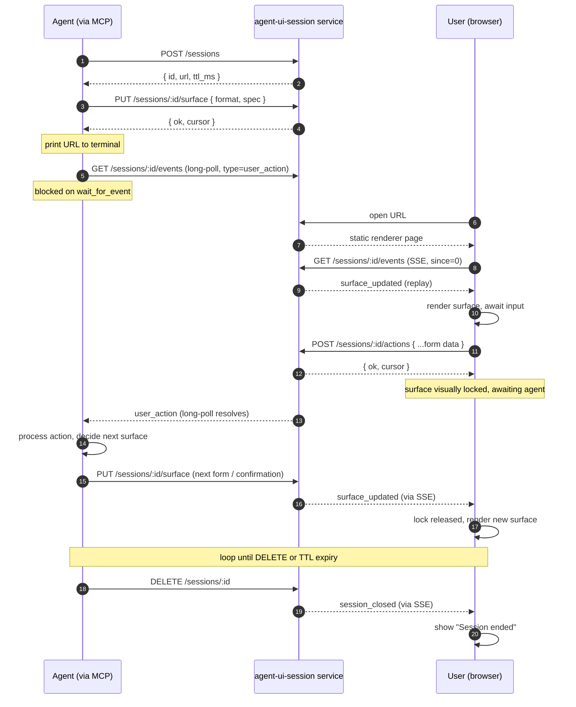

# PRD — Agent UI Session

## Problem

Terminal-bound AI agents (Claude Code, Cursor, Aider, ChatGPT CLI, custom
Python/TS agents) cannot render UI. They emit text or markdown. When a task
needs a real form — picking a date, selecting one of twelve options,
filling a multi-field intake — the agent either fakes it with prose
(brittle, error-prone) or punts to the user to type structured input by
hand (slow, lossy).

Generative-UI frameworks like A2UI, Vercel `streamUI`, and CopilotKit solve
the rendering side, but they all assume a renderer that the **host
application** owns and controls. That assumption breaks the moment the
agent is the host — a CLI, an SSH session, an editor extension running
in someone else's IDE.

## Solution

A hosted service that lets **any agent** produce rich, interactive UI for
its user without owning a renderer.

The agent emits a UI spec to the service and prints a short URL. The user
clicks; the rendered UI opens in the browser. The user interacts; the
agent reads the resulting state via API and continues. The service is the
shared rendezvous: opaque to the agent's host, opaque to the user's
browser engine, addressable by a single URL.

The UI spec format is **A2UI v0.9** today, but the service stores it
opaque and format-tagged so any future spec (A2UI vNext, a custom JSON,
HTMX) drops in without breaking clients.

## Core flow



## Concepts

- **Session** — ephemeral, isolated container with a unique short URL.
  Default TTL 30 minutes; touched on every mutating request.
- **Surface** — the current UI spec the renderer should display. Exactly
  one surface per session at any time. A2UI v0.9 JSON in V0;
  format-tagged so swappable later.
- **Event** — an entry in the session's append-only log. Three types:
  `surface_updated` (agent pushed a new surface), `user_action` (user
  submitted/clicked), `session_closed` (TTL expired or DELETE).
- **Cursor** — the monotonic id of the last event. Clients pass `since=N`
  to resume.

### Surface lifecycle: forms are one-shot

A surface is **single-use**. The user fills the form (or clicks the
button) once; the moment that `POST /actions` lands, the surface is
considered consumed:

- The renderer optimistically locks the UI: a banner appears
  ("Sent — waiting for the agent…"), inputs become aria-disabled, and
  any further submissions on that surface are dropped client-side.
- The action is now the agent's to pick up. The agent's pending
  `wait_for_event` long-poll resolves with the `user_action`.
- The lock releases only when the agent pushes a new `surface_updated`
  (replacing the form with a confirmation, the next step, an error
  retry — whatever the agent decides) or the session closes.

This is intentional. Forms are not reusable widgets the user "fills in
and walks away from" — each surface represents one decision point in the
agent's workflow. If the agent wants another piece of input, it sends
another surface. This keeps the contract simple: one surface, one action,
one agent turn.

## REST API (V0)

All endpoints return JSON. `:id` is a 128-bit hex session id.

### `POST /sessions`

Create a new session.

- Request body: none.
- Response `201`: `{ id: string, url: string, ttl_ms: number }`
  - `url`: `<PUBLIC_URL>/<id>` — the page the user opens.
- Side effect: starts the TTL clock.

### `GET /sessions/:id`

Read session metadata and the current surface (no events).

- Response `200`: `{ id, surface: { format, spec } | null, expires_at, cursor }`
- `404` if the session is unknown or expired.

### `PUT /sessions/:id/surface`

Replace the current surface. Called by the agent.

- Request body: `{ format: string, spec: unknown }`
  - `format` is opaque to the service; today always `"a2ui-v0.9"`.
  - `spec` is opaque to the service; the renderer parses it.
- Response `200`: `{ ok: true, cursor: number }`
- `400` if body is malformed (missing `format` or `spec`).
- `404` if the session is unknown or expired.
- Side effects: stores the surface, appends a `surface_updated` event,
  fans out to SSE/long-poll waiters, touches TTL.

### `POST /sessions/:id/actions`

Append a user action. Called by the renderer when the user submits or
clicks.

- Request body: opaque JSON. The renderer sends an A2UI client-action
  shape: `{ name, surfaceId, sourceComponentId, context, timestamp }`.
- Response `200`: `{ ok: true, cursor: number }`
- `400` if body is not valid JSON.
- `404` if the session is unknown or expired.
- Side effects: appends a `user_action` event, fans out, touches TTL.

### `GET /sessions/:id/events?since=N&type=...`

Stream or long-poll events. Single endpoint, content-negotiated.

- `Accept: text/event-stream` → SSE. Each event sent as
  `id: N\ndata: {...}\n\n`. Stream closes when `session_closed` is
  emitted. Backlog (`events` with `id > since`) is replayed first,
  then the stream stays open.
- Otherwise → JSON long-poll. If backlog exists, returns it
  immediately. Otherwise blocks up to `timeout_ms` (default 25s,
  capped at 25s) for the next event. Returns
  `{ events: [...], cursor: N }`. Empty `events` means the long-poll
  timed out — the client retries.
- `since=N` (default `0`): events with `id > since` only.
- `type=user_action` | `surface_updated`: optional filter, useful for
  the agent's `wait_for_event` so it doesn't see its own
  `surface_updated` echoes.
- `404` if the session is unknown or expired.

### `DELETE /sessions/:id`

End the session.

- Response `200`: `{ ok: true }`.
- `404` if unknown.
- Side effects: appends `session_closed`, fans out, removes the session.

### Event shapes

```ts
type Event =
  | { id: number; ts: number; type: 'surface_updated'; format: string; spec: unknown }
  | { id: number; ts: number; type: 'user_action'; action: unknown }
  | { id: number; ts: number; type: 'session_closed' };
```

`id` is per-session and monotonic starting at 1. `ts` is Unix ms.

## Distribution: MCP + Skill (no public SDK in V0)

**MCP server** exposes two tools:

- `show_ui(spec) -> { session_id, url }` — calls `POST /sessions` then
  `PUT /surface`, returns immediately so the agent can print the URL.
- `wait_for_event(session_id, timeout_s?) -> event | null` — long-polls
  with `type=user_action`. Default 25s, well under MCP host timeouts.
  Returns `null` on timeout; the agent loops.

**Skill file** (`SKILL.md`) ships alongside the MCP server and teaches
the agent the call pattern in two paragraphs:

> When you need user input or want to show a dashboard, call `show_ui`
> with an A2UI surface, then `wait_for_event` until the user responds.

The two-tool pattern is the deliberate hard-problem call: explicit,
robust to host timeouts, no webhooks.

## Renderer

A static page served at `GET /:session_id` that mounts the existing
**A2UI Lit shell** and subscribes to `/sessions/:id/events` via
`EventSource`. Reuse, don't reinvent. Lives in `client/`.

The renderer is responsible for the one-shot lock UX described above:
optimistic `awaiting` flag set on submit, banner shown, lock released
on the next `surface_updated`.

## Storage

V0 was in-memory `Map<sessionId, Session>` with TTL eviction. V1 adds
Supabase Postgres as durable backing — sessions, surfaces, and the
event log survive restarts. The in-memory Map remains as the live
working set; writes are synchronous through to Postgres. See
`docs/superpowers/specs/2026-05-09-supabase-persistence-design.md`.

Single-process. Multi-process / horizontal scale is V2.

## Scope V0 — in

- Anonymous shareable-link sessions (security via 128-bit random IDs).
- A2UI v0.9 surfaces only.
- Single-user, single-tab session.
- MCP server (TS) + Skill file.
- Long-poll `wait_for_event`.
- One-shot surface lifecycle (form fills consumed on submit).

## Scope V0 — out

- Auth / per-user sessions.
- Public SDK.
- Multi-tab sync.
- Custom themes.
- Persistence beyond TTL (moved to V1, in progress).
- Charts/tables/components not in the A2UI catalog.
- Surface "reuse" — once a form's submitted, it's consumed.

## Stack

- Backend: **TypeScript + Hono** on Node 22+ (single-file capable; today
  ~200 lines).
- Renderer: static page (Vite-built) embedding the A2UI Lit shell,
  fetches state via REST/SSE.
- MCP server: separate package using `@modelcontextprotocol/sdk`.
- Persistence (V1): Supabase Postgres via `postgres` (porsager).
- Deploy: Cloudflare Workers or Fly. Localhost for demo.

## Success criteria (V0)

- Agent in Claude Code calls `show_ui` → user sees working form in
  browser within **2 s**.
- Agent receives form submission as structured event within **1 s** of
  user click.
- MCP server install is one config line; Skill file is drop-in.
- End-to-end demo runs locally with `npm run dev`.

## Open questions (deferred, not blockers)

- Hosting (CF Workers vs Fly vs self-host) — defer until first real
  deploy.
- Terminal URL clickability (iTerm vs Alacritty vs Windows Terminal) —
  handle in Skill prose.
- Rate limits / abuse — add per-IP cap when public.
