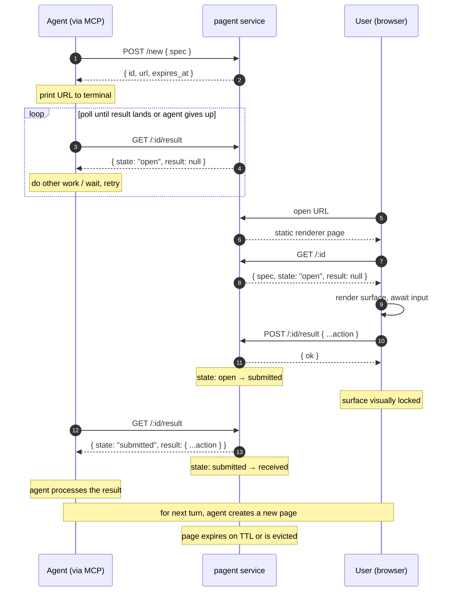

# PRD — Pagent

## Problem

Terminal-bound AI agents (Claude Code, Cursor, Aider, ChatGPT CLI, custom
Python/TS agents) cannot render UI. They emit text or markdown. When a task
needs a real form — picking a date, selecting one of twelve options,
filling a multi-field intake — the agent either fakes it with prose
(brittle, error-prone) or punts to the user to type structured input by
hand (slow, lossy).

Generative-UI frameworks like A2UI, Vercel `streamUI`, and CopilotKit solve
the rendering side, but they all assume a renderer that the **host
application** owns and controls. That assumption breaks the moment the
agent is the host — a CLI, an SSH session, an editor extension running
in someone else's IDE.

## Solution

A hosted service that lets **any agent** produce rich, interactive UI for
its user without owning a renderer.

The agent emits a UI spec to the service in a single POST and prints a
short URL. The user clicks; the rendered UI opens in the browser. The
user submits; the agent reads the result via API and continues. The
service is the shared rendezvous: opaque to the agent's host, opaque to
the user's browser engine, addressable by a single URL.

The UI spec format is **A2UI v0.9** today. Adding another format (A2UI
vNext, custom JSON, HTMX) is a future change to the wire shape, not a
guarantee built into V0.

## Core flow

## Concepts

- **Page** — an ephemeral, single-purpose UI rendezvous with a unique
  short URL. Created in one POST that includes the spec. Default TTL
  30 minutes.
- **Spec** — the A2UI v0.9 JSON the renderer should display. Provided
  at page creation; immutable for the lifetime of the page.
- **State** — a 3-state field that captures the page's lifecycle:
  - `open` — page exists; user has not submitted.
  - `submitted` — user has POSTed a result; the agent has not yet
    fetched it.
  - `received` — the agent has fetched the result. The renderer can
    use this to show "the agent has your input" feedback.
- **Result** — the user's submission, captured once. The action JSON
  posted by the renderer (A2UI client-action shape:
  `{ name, surfaceId, sourceComponentId, context, timestamp }`).

### Single-shot lifecycle

A page is **single-use**. The user fills the form (or clicks the button)
once; the moment that `POST /:id/result` lands, the page is
considered consumed:

- The renderer optimistically locks the UI: a banner appears
  ("Sent — waiting for the agent…"), inputs become aria-disabled,
  and any further submissions on that page are dropped client-side.
- The result is the agent's to pick up on its next poll of
  `GET /:id/result`.
- For the next step in a multi-step flow, the agent creates a **new
  page** with a new URL and prints it. There is no "replace the
  surface in place" mechanism in V0.

This is intentional. Pages are not reusable widgets; each page
represents one decision point in the agent's workflow. Keeping pages
single-shot is what lets us drop the event-log abstraction, drop SSE
fan-out, drop long-polling, and keep the server stateless beyond the
page Map.

## REST API (V0)

All endpoints return JSON immediately — no blocking, no streaming.
`:id` is a 128-bit hex page id.

### `POST /new`

Create a new page with its surface in one shot.

- Request body: `{ spec: unknown }`
  - `spec` is opaque to the service. Today the renderer assumes A2UI
    v0.9; the service does not parse or validate.
- Response `201`: `{ id, url, expires_at }`
  - `url`: `<PUBLIC_URL>/<id>` — the page the user opens.
- `400` if body is malformed (missing `spec`).

### `GET /:id`

Read the page (used by the renderer; safe for anyone to fetch — no
side effect on the state machine).

- Response `200`: `{ spec, state, result, expires_at }`
  - `state`: `"open" | "submitted" | "received"`.
  - `result`: the submitted action, or `null` if `state === "open"`.
- `404` if unknown or expired.

### `POST /:id/result`

Submit the user's action. Called by the renderer.

- Request body: opaque JSON. The renderer sends an A2UI client-action
  shape: `{ name, surfaceId, sourceComponentId, context, timestamp }`.
- Response `200`: `{ ok: true }`.
- `404` if unknown or expired.
- `409` if the page has already been submitted (state is not `open`).
- Side effect: transitions `open → submitted`, stores the action.

### `GET /:id/result`

Read the user's result. Called by the agent. **Returns immediately —
no waiting, no parameters.** Polling is the agent's job (see Skill).

- Response `200`: `{ state, result }`.
  - `result` is `null` while `state === "open"`.
  - `result` is the submitted action when `state` is `"submitted"`
    or `"received"`.
- `404` if unknown or expired.
- Side effect: the **first read while `state === "submitted"`**
  transitions the page to `"received"`. This is the "agent viewed the
  data" signal the renderer can pick up via `GET /:id`.

## Distribution: MCP + Skill (no public SDK in V0)

**MCP server** exposes two tools, both fire-and-return (no blocking):

- `show_ui(spec) -> { page_id, url }` — calls `POST /new` and returns
  immediately so the agent can print the URL.
- `check_result(page_id) -> { state, result }` — calls
  `GET /:id/result`. Returns the current state plus the result (or
  `null` while the user hasn't submitted). The agent polls.

**Skill file** (`SKILL.md`) ships alongside the MCP server and teaches
the polling pattern in plain prose:

> Call `show_ui(spec)` and print the URL. Then call `check_result`. If
> `state === "open"`, the user hasn't responded yet — wait a few
> seconds (or do other work) and call again. When `result` is
> populated, you have the user's input. The renderer detects that
> you've fetched it (state flips to `"received"`) and shows "the
> agent has your input" feedback to the user.

Polling beats long-polling here because users can take much longer
than any sane HTTP timeout (90 seconds, three minutes, walked away
to make coffee). The agent decides cadence and can do useful work
between checks.

## Renderer

A static page served at `GET /:id` that mounts the existing
**A2UI Lit renderer** and fetches state via the JSON API. Reuse,
don't reinvent. Lives in `client/`.

The renderer flow is fetch-once on load, then optimistic-only on submit:

1. On mount, `GET /:id` to load the spec.
2. Render the surface with A2UI's `MessageProcessor` + `<a2ui-surface>`.
3. On user submit, fire `POST /:id/result` and immediately enter
   the visual lock state ("Sent — waiting for the agent…"). No further
   server signal is required for the lock.
4. (Optional polish) The renderer may poll `GET /:id` after submit to
   detect the `received` transition and upgrade the banner from
   "waiting for the agent" to "the agent has your input".

No SSE. No event stream. No long-poll. The renderer's only outbound
write is the result POST.

## Storage

V0 is in-memory `Map<pageId, Page>` with TTL eviction (lazy on access
plus a 60-second sweep). Single-process.

V1 adds Supabase Postgres as durable backing — pages, specs, and
results survive restarts. The in-memory Map remains as the live working
set; writes are synchronous through to Postgres. See
`docs/superpowers/specs/2026-05-09-supabase-persistence-design.md`.

## Scope V0 — in

- Anonymous shareable-link pages (security via 128-bit random IDs).
- A2UI v0.9 surfaces.
- Single-user, single-tab page.
- MCP server (TS) + Skill file.
- Polling-based result delivery (agent calls `check_result` on its own
  cadence).
- Single-shot page lifecycle (one spec, one result).
- `received` state as the "agent viewed it" signal.

## Scope V0 — out

- **Multi-turn surface replacement.** A page is single-shot; for a
  multi-step flow, the agent creates a new page. PUT/PATCH on a page
  is not supported.
- **Event streaming (SSE) and long-polling.** Removed in favour of
  fetch-once + optimistic lock + agent-side polling. Users routinely
  take longer than any sane HTTP timeout, so blocking is dead weight.
- **Multi-format spec.** The wire shape today does not carry a `format`
  tag; the renderer assumes A2UI v0.9. Adding format negotiation is a
  future wire change, not a V0 guarantee.
- **Auth / per-user sessions.** Anonymous link only.
- **Public SDK.** MCP + Skill are the distribution.
- **Multi-tab sync, custom themes, components beyond the A2UI catalog,
  charts/tables.** All V1+.
- **Persistence beyond TTL.** Moved to V1 (in progress).

## Stack

- Backend: **TypeScript + Hono** on Node 22+ (single-file capable).
- Renderer: static page (Vite-built) embedding the A2UI Lit renderer,
  fetches state via REST.
- MCP server: separate package using `@modelcontextprotocol/sdk`.
- Persistence (V1): Supabase Postgres via `postgres` (porsager).
- Deploy: Cloudflare Workers or Fly. Localhost for demo.

## Success criteria (V0)

- Agent in Claude Code calls `show_ui` → user sees working form in
  browser within **2 s**.
- Agent receives form submission as structured action on its **next
  poll** of `check_result` after the user clicks (≤ poll interval).
- MCP server install is one config line; Skill file is drop-in.
- End-to-end demo runs locally with `npm run dev`.
- The renderer can show three distinct states reflecting the page's
  state field: ready-to-fill, submitted-awaiting-agent, agent-received.

## Open questions (deferred, not blockers)

- Hosting (CF Workers vs Fly vs self-host) — defer until first real
  deploy.
- Terminal URL clickability (iTerm vs Alacritty vs Windows Terminal) —
  handle in Skill prose.
- Rate limits / abuse — add per-IP cap when public.
- Whether the renderer should poll `GET /:id` to upgrade the
  "waiting" banner to "received", or whether the optimistic lock alone
  is enough UX.
- Recommended polling cadence in the Skill prose (start at 2 s? back
  off? cap?). For now, leave it to the agent's judgement.
