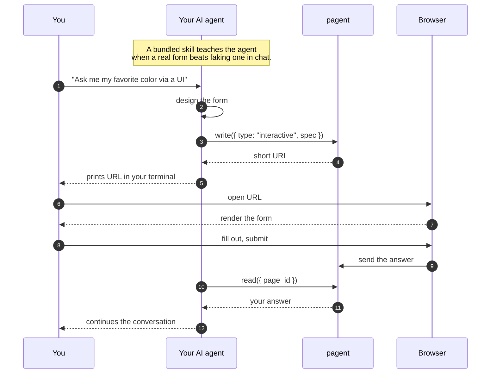

# Pagent

[](https://github.com/blockful/pagent/actions/workflows/ci.yml)

Pages for AI agents, with exactly two MCP tools. `write` creates a browser page;
`read` returns its response or presentation analytics. A page can be a temporary
interactive form, a temporary view-only document, or a durable, shareable
presentation.

- **Live API:** https://api.pagent.link
- **Live renderer:** https://pagent.link

See the [v0.1.0 PRD](./docs/PRD-v0.1.0-secure-deck-sharing.md) for the active
product requirements and [DESIGN.md](./DESIGN.md) for the interface system.
The root `PRD.md` and `docs/HANDOFF.md` are retained only as historical V0
context.

## How it works

A non-technical view of what happens when an agent needs structured input:



In plain English: the agent decides which page type fits the job, writes it,
and prints the returned URL. For an interactive page, you submit once and the
agent reads the response. For a document, you only view it. For a presentation,
the authenticated owner manages sharing and reads engagement analytics.

### One page model

| Page type      | Lifecycle                      | What `read` returns     | Authentication                                      |
| -------------- | ------------------------------ | ----------------------- | --------------------------------------------------- |
| `interactive`  | Temporary                      | Submitted user response | Optional only while anonymous grace mode is enabled |
| `document`     | Temporary                      | No response; view-only  | Optional only while anonymous grace mode is enabled |
| `presentation` | Durable, revisioned, shareable | Engagement analytics    | Required                                            |

Presentation pages have explicit slide boundaries so Pagent can calculate
active time, completion, furthest slide, and drop-off reliably. The web app
provides the authenticated page library, page detail, sharing controls, and an
`/admin` workspace-governance surface. Internal `/v1/decks` REST routes and
`deck_*` tables retain established implementation names; they are not separate
product primitives or MCP tools.

### The two MCP tools

- `write` accepts one discriminated page type: `interactive` with an A2UI
  `spec`, `document` with sanitized `html`, or `presentation` with a title and
  ordered slides. Supplying a presentation `page_id` creates a new immutable
  revision of that durable page.
- `read` accepts a `page_id`. Temporary interactive pages return a response
  state immediately; durable presentation pages return authorized analytics.
  `include: "response" | "analytics"` is optional when the page ID already
  makes the intent clear.

There are no extra management tools. Sharing, access policy, membership,
retention, and audit operations live in the authenticated web app and REST API.

### Breaking migration

The two-tool contract is intentionally breaking. There are no legacy aliases:

| Removed tool   | Replacement                                           |
| -------------- | ----------------------------------------------------- |
| `show_ui`      | `write({ type: "interactive", spec })`                |
| `show_html`    | `write({ type: "document", html })`                   |
| `publish_deck` | `write({ type: "presentation", title, slides, ... })` |
| `check_result` | `read({ page_id, include: "response" })`              |

Restart the MCP client after upgrading so it refreshes the advertised tool
list. Clients should see exactly `write` and `read`.

## Layout

npm-workspaces monorepo. Three apps + the plugin scaffolding.

```
railway.json                          # Railway API service config (repo-root deploy)
apps/
├── api/                             # REST service (Hono). Deployed on Railway.
│   ├── server.ts
│   └── .env.example
├── web/                             # Vite-served renderer. Deployed on Vercel.
│   ├── index.html, main.ts
│   ├── vite.config.ts
│   ├── vercel.json
│   └── .env.example
└── mcp/                             # stdio MCP server: exactly write + read
    ├── server.ts                     # source
    ├── server.bundle.js              # esbuild output, shipped to plugin users
    ├── smoke.mjs
    └── .env.example
infra/
└── observability/                   # self-hosted Grafana stack on Railway
    ├── Dockerfile                    # grafana/otel-lgtm + provisioning
    ├── dashboards/                   # Operations + Product dashboards (JSON)
    └── provisioning/                 # Grafana datasources + dashboard provider
skills/pagent/SKILL.md                # drop-in skill for page creation, polling, and analytics
.claude-plugin/plugin.json            # Claude Code plugin manifest
.mcp.json                             # plugin's MCP server registration
```

**Observability** — see [docs/observability.md](./docs/observability.md) for
the self-hosted Grafana stack (metrics, traces, logs) on Railway.

The repo doubles as a Claude Code plugin and a self-hosted marketplace: `.claude-plugin/plugin.json`, `.claude-plugin/marketplace.json`, `skills/`, and `.mcp.json` at the repo root make it installable from GitHub with two slash commands. The skill stays at the root because Claude Code's plugin loader looks for `skills/` next to `.claude-plugin/`, even though the skill conceptually belongs to `apps/mcp/`.

## Environment variables

Each app validates its environment at boot/build with Zod and fails loudly on missing or malformed values — no silent defaults that bite in production. `.env.example` files in each app are the source of truth.

| App                                               | Variable                                                                       | Required?             | Validation / default                                                                                                                              |
| ------------------------------------------------- | ------------------------------------------------------------------------------ | --------------------- | ------------------------------------------------------------------------------------------------------------------------------------------------- |
| **api** ([`.env.example`](apps/api/.env.example)) | `DATABASE_URL`                                                                 | **always**            | Non-empty string. Boot fails with a `ZodError` otherwise.                                                                                         |
|                                                   | `PUBLIC_URL`                                                                   | **production**        | HTTPS renderer origin. Used in `write` responses.                                                                                                 |
|                                                   | `API_PUBLIC_URL`                                                               | **production**        | HTTPS API origin. Used for OAuth issuer, callbacks, magic links, and discovery metadata.                                                          |
|                                                   | `ALLOWED_ORIGINS`                                                              | **production**        | Comma-separated origin list. CORS allow-list.                                                                                                     |
|                                                   | `PORT`                                                                         | optional              | Coerced to number. Default `8787`. Railway sets this.                                                                                             |
|                                                   | `PAGE_TTL_MS`                                                                  | optional              | Coerced to number. Default `1800000` (30 min).                                                                                                    |
|                                                   | `RATE_LIMIT_MAX`                                                               | optional              | Positive integer. Default `30`; caps temporary writes and public viewer access/visit starts per client IP. Engagement delivery uses 20x this cap. |
|                                                   | `RATE_LIMIT_WINDOW_MS`                                                         | optional              | Positive integer. Default `60000`; shared by the write and viewer limits.                                                                         |
|                                                   | `TRUSTED_PROXY_MODE`                                                           | **production**        | Must be `railway`; trusts Railway's `X-Real-IP` for rate limiting and ignores `X-Forwarded-For`.                                                  |
|                                                   | `REQUIRE_AUTH`                                                                 | optional              | Boolean. Default `false`; grace mode permits temporary page writes/response reads only. Durable pages and analytics always require auth.          |
|                                                   | `JWT_SIGNING_KEY` / `JWT_PUBLIC_KEY`                                           | when auth is required | Base64url DER Ed25519 private/public key pair used to sign and verify access tokens.                                                              |
|                                                   | `GOOGLE_CLIENT_ID` / `GOOGLE_CLIENT_SECRET`                                    | when auth is required | Google OAuth credentials. `GOOGLE_REDIRECT_URI` defaults to `{API_PUBLIC_URL}/oauth/callback/google`.                                             |
|                                                   | `AUTH_STATE_SECRET`                                                            | when configured       | OAuth state HMAC secret; at least 32 UTF-8 bytes. Required when auth is enabled.                                                                  |
|                                                   | `SMTP_HOST` / `SMTP_USER` / `SMTP_PASS`                                        | when auth is required | SMTP credentials for magic links. `SMTP_PORT` defaults to `587`; `SMTP_FROM` to `noreply@pagent.link`.                                            |
|                                                   | `SESSION_MAX_AGE_DAYS` / `REFRESH_TOKEN_MAX_DAYS` / `ACCESS_TOKEN_TTL_SECONDS` | optional              | Defaults `30` / `90` / `3600`.                                                                                                                    |
|                                                   | `NODE_ENV`                                                                     | optional              | One of `development` \| `production` \| `test`. Gates the production-only refinements above.                                                      |
|                                                   | `LOG_LEVEL`                                                                    | optional              | Pino level. Default `info`.                                                                                                                       |
|                                                   | `OTEL_EXPORTER_OTLP_*`                                                         | optional              | OpenTelemetry exporter config. Leave `OTEL_EXPORTER_OTLP_ENDPOINT` unset to disable tracing.                                                      |
| **web** ([`.env.example`](apps/web/.env.example)) | `VITE_API_URL`                                                                 | **`vite build`**      | Valid URL. Inlined at build time and embedded in CSP. `vite dev` allows it unset (uses Vite proxy).                                               |
|                                                   | `API_PORT` / `CLIENT_PORT`                                                     | optional (dev only)   | Valid port (1–65535). Defaults `8787` / `8788`.                                                                                                   |
| **mcp** ([`.env.example`](apps/mcp/.env.example)) | `PAGENT_URL`                                                                   | optional              | Valid URL when set. Default `https://api.pagent.link`.                                                                                            |
|                                                   | `PAGENT_TOKEN`                                                                 | when auth is required | OAuth bearer token used by the stdio MCP transport for protected API calls.                                                                       |

When validation fails, the process logs the offending field and exits with a non-zero code — CI catches misconfigured deploys (`build:web` runs in CI with a placeholder `VITE_API_URL`) before they ship.

## Install as a Claude Code plugin

**Prerequisites:** Claude Code, Node 22+.

**1. Install** — paste these two commands into any Claude Code session:

```
/plugin marketplace add blockful/pagent
/plugin install pagent@pagent
```

The MCP server ships pre-bundled (`apps/mcp/server.bundle.js`), so there's no `npm install` step on your side — Claude Code can spawn it directly.

**2. Verify** — confirm the MCP server is connected:

```
/mcp
```

You should see `pagent` listed with exactly `write` and `read`. The plugin also
ships a skill (`pagent`) that teaches page selection, response polling, and
presentation analytics.

**3. Use it** — try this prompt:

> "Use the pagent skill to ask me my favorite color via a UI form."

The agent calls `write` with `type: "interactive"`, prints a URL hosted at
`https://pagent.link`, you submit, and it calls `read` to continue the
conversation.

**Point at a different service?** Set `PAGENT_URL` before launching Claude. By default the MCP talks to `https://api.pagent.link`.

## Use it from any MCP client (HTTP transport)

Beyond the Claude Code plugin, pagent's MCP also speaks the streamable HTTP transport — so any MCP-capable client (Codex, OpenCode, Cursor, Cline, Continue, etc.) can connect with one command and zero local install:

```bash
# Claude Code, without the plugin (HTTP MCP, scoped to the current project)
claude mcp add --scope project --transport http pagent "https://api.pagent.link/mcp"
```

**Cursor / Cline / Continue** (and most other JSON-config clients) — add to their `mcp.json`:

```json
{
  "mcpServers": {
    "pagent": {
      "type": "http",
      "url": "https://api.pagent.link/mcp"
    }
  }
}
```

**Codex** — its config is TOML, not JSON. Add to `~/.codex/config.toml`:

```toml
[mcp_servers.pagent]
url = "https://api.pagent.link/mcp"
```

**OpenCode** — add to `opencode.json` (note `"type": "remote"`, not `"http"`):

```json
{
  "mcp": {
    "pagent": {
      "type": "remote",
      "url": "https://api.pagent.link/mcp"
    }
  }
}
```

The HTTP MCP runs in the same process as the REST service (single Railway
deploy, no extra infra) and shares the exact `write` / `read` definitions with
the bundled stdio MCP.

**Self-hosting?** Replace the URL with `http://your-host:8787/mcp`.

## Quick start (development)

```bash
git clone git@github.com:blockful/pagent.git
cd pagent
npm install                         # workspaces install for all three apps
npm run dev                         # API on :8787, renderer on :8788
npm run build:mcp                   # rebuild apps/mcp/server.bundle.js after editing server.ts
```

Open `http://localhost:8788/<page_id>` to view a page. To use the local API from a Claude session, install the plugin from the local checkout instead of the marketplace:

```bash
claude --plugin-dir /absolute/path/to/pagent
PAGENT_URL=http://localhost:8787 claude   # then talk to local API
```

### Shutdown behavior

The API handles `SIGTERM` and `SIGINT` gracefully:

1. Stops accepting new connections.
2. Waits up to 10 seconds for in-flight requests to finish.
3. Force-closes idle keep-alives if the timeout is hit.
4. Closes the Postgres pool and exits.

Railway sends SIGTERM during deploys; Ctrl+C in dev sends SIGINT.

### Quality gate

A Husky `pre-push` hook runs `typecheck → lint → format:check → test`
on every `git push`. To run it manually before pushing:

    .husky/pre-push

To bypass in an emergency: `git push --no-verify` (don't make this a habit).

## Deploy

### API → Railway

The repository-root `railway.json` contains the build + start config. The API
must deploy from the repository root because it uses npm workspaces and serves
`docs/openapi.yaml` at runtime. To deploy:

1. Create a new Railway service from this repo.
2. Leave **Root Directory** unset so Railway includes the root workspace,
   lockfile, `apps/api`, and `docs/openapi.yaml` and picks up `railway.json`.
3. Set environment variables (see `apps/api/.env.example`):
   - `PUBLIC_URL` — the Vercel URL of `apps/web` (e.g. `https://pagent.link`). Used in MCP `write` responses. **Required in production.** Boot fails loudly if missing.
   - `API_PUBLIC_URL` — the Railway public origin of `apps/api` (e.g. `https://api.pagent.link`). Used for OAuth issuer/discovery, default Google callbacks, magic links, and MCP auth metadata. **Required in production.** Must be HTTPS.
   - `ALLOWED_ORIGINS` — comma-separated origins allowed to call the API (set to your Vercel URL). **Required in production.** API boot fails loudly if missing.
   - `PORT` — Railway sets this automatically; the server reads it.
   - `PAGE_TTL_MS` — optional; default 30 minutes.
   - `RATE_LIMIT_MAX` / `RATE_LIMIT_WINDOW_MS` — optional. Per-IP limits for temporary writes and public viewer access/visit starts. Engagement delivery uses 20x the base cap for heartbeats. Defaults: 30 / 60000.
   - `TRUSTED_PROXY_MODE` — set to `railway` after confirming staging traffic reaches the API only through Railway ingress. This trusts Railway's `X-Real-IP` and ignores `X-Forwarded-For`. **Required in production.**
   - `REQUIRE_AUTH` — set to `true` to enforce authentication and scopes for temporary page writes/response reads too. Leave `false` only for the documented rollout grace period; durable pages and analytics still require authentication.
   - `JWT_SIGNING_KEY` / `JWT_PUBLIC_KEY` — base64url-encoded DER Ed25519 key pair. Required when `REQUIRE_AUTH=true`.
   - `GOOGLE_CLIENT_ID` / `GOOGLE_CLIENT_SECRET` — Google OAuth credentials. `GOOGLE_REDIRECT_URI` is optional and defaults to `${API_PUBLIC_URL}/oauth/callback/google`.
   - `AUTH_STATE_SECRET` — secret used to authenticate OAuth state. Required when auth is enabled; any configured value must be at least 32 UTF-8 bytes.
   - `SMTP_HOST` / `SMTP_USER` / `SMTP_PASS` — SMTP credentials for magic-link login. Required when auth is enabled. `SMTP_PORT` and `SMTP_FROM` have defaults.
   - `SESSION_MAX_AGE_DAYS` / `REFRESH_TOKEN_MAX_DAYS` / `ACCESS_TOKEN_TTL_SECONDS` — optional auth lifetime controls. Defaults: 30 / 90 / 3600.
   - `OTEL_EXPORTER_OTLP_ENDPOINT` — optional. Grafana Cloud OTLP HTTP base URL (e.g. `https://otlp-gateway-prod-us-central-0.grafana.net/otlp`). Leave unset to disable observability entirely. See `apps/api/.env.example` for the rest of the OTel envs.
4. Deploy. Railway runs `npm ci` at the repository root and starts the API with
   `npm -w @pagent/api run start`.

The `/health` endpoint is configured as the healthcheck path. Returns 200 only when the DB is reachable; 503 otherwise.

### `apps/web/` → Vercel

`apps/web/vercel.json` handles the build. To deploy:

1. Create a new Vercel project from this repo.
2. Set **Root Directory** to `apps/web` so vercel.json is picked up.
3. Set environment variables (see `apps/web/.env.example`):
   - `VITE_API_URL` — the Railway URL of `apps/api` (e.g. `https://api.pagent.link`). Inlined at build time, so a redeploy is needed if this changes. **Required for `vite build`** — the build fails loudly if missing or malformed (prevents shipping a bundle that silently calls relative paths).
4. Deploy. Vercel runs `npm install` from the monorepo root (workspace install) and `npm run build:web`, outputting `apps/web/dist/`.

`vite dev` (i.e. `npm run dev`) does not require `VITE_API_URL` — it falls back to Vite's proxy for same-origin paths, so local development works zero-config.

#### Security headers

The renderer derives its strict Content-Security-Policy from
`VITE_API_URL` at build time and injects it as a `<meta>` tag in
`index.html`. Self-hosters at a different API origin only need to
set `VITE_API_URL` correctly when deploying to Vercel — no source
edit required. HSTS / nosniff / frame-deny / referrer-policy /
permissions-policy are set as HTTP headers via `apps/web/vercel.json`.

### Order matters

Provision the Railway and Vercel public domains first. Set Railway's `API_PUBLIC_URL` to its own API origin and `PUBLIC_URL` + `ALLOWED_ORIGINS` to the Vercel renderer origin. Set Vercel's `VITE_API_URL` to the Railway origin, then deploy both services.

## Operations

This section is for on-call engineers. It documents the observable surface of the
system so you can answer "is it broken, what broke, how do I fix it?" without
reading the code.

- **Machine-readable API contract:** `GET /openapi.json` (canonical JSON, OpenAPI 3.1) or `GET /openapi.yaml` (same spec, raw YAML for humans). Interactive reference at `GET /docs` (Scalar). Source lives at `docs/openapi.yaml` in the repo and is loaded once at boot.

### Health check

```
GET /health
```

This is an ops endpoint, not part of the API contract. Railway polls it
automatically and restarts the service on 503.

**Healthy response** (`200`):

```json
{ "ok": true, "db": "ok" }
```

**Failure response** (`503`) — Postgres is unreachable:

```json
{ "ok": false, "db": "error", "message": "Database connection failed" }
```

There is no `pages` count in the response; the field was removed in an earlier
refactor. The response shape is exactly what is shown above.

Quick smoke from the terminal:

```bash
curl -sf https://api.pagent.link/health
```

### Logs and traces

**Logs:** The API uses [Pino](https://getpino.io). In production (`NODE_ENV=production`)
every event is one JSON object per line. In dev the output is pretty-printed via
`pino-pretty`. Each line carries at minimum `level`, `time`, and `msg`, plus
per-event fields. Request log lines look like:

```
{"level":30,"time":1709120000000,"req_id":"a1b2c3d4e5f6a7b8c9d0e1f2a3b4c5d6","method":"POST","path":"/new","status":201,"duration_ms":17,"msg":"request"}
```

Every response carries `X-Request-ID` (32-char hex). Quote it in bug
reports — the same ID appears on every log line for that request and
any traces in Grafana.

Where to find them: **Railway dashboard → API service → Logs tab**.

**Traces:** If `OTEL_EXPORTER_OTLP_ENDPOINT` is set, traces flow to Grafana Cloud
(Tempo) over OTLP/HTTP. Auto-instrumentation covers HTTP, fetch, and Postgres.
The Pino instrumentation injects `trace_id` and `span_id` into every log line,
so pivoting from a log line to its trace in Grafana is a single click. Leave
`OTEL_EXPORTER_OTLP_ENDPOINT` unset to disable OTel entirely — the SDK does not
start and there is zero overhead.

**No metrics endpoint:** there is no `/metrics` or Prometheus scrape target.
Operations rely on log aggregation and traces. Build throughput/latency dashboards
in Grafana from the trace and log streams.

### Common failure modes

| Symptom                                             | Likely cause                                             | Where to look                                     | First response                                                                                                                                   |
| --------------------------------------------------- | -------------------------------------------------------- | ------------------------------------------------- | ------------------------------------------------------------------------------------------------------------------------------------------------ |
| `GET /health` → 503                                 | Postgres unreachable                                     | Supabase status page; Railway DB env vars         | Check Supabase dashboard. If the DB is up but the env var was rotated, restore `DATABASE_URL` in Railway and redeploy.                           |
| Spike of 429s on temporary writes or viewer POSTs   | Per-IP rate limit hit (default 30 base requests / 60 s)  | Railway logs — group by client IP                 | Legit spike: bump `RATE_LIMIT_MAX` in Railway env and restart (no redeploy needed). Abuse: block at the network edge.                            |
| 413 on `POST /new`                                  | A2UI spec > 256 KB or total JSON/HTML body > 1 MB        | Response fields `format` and `max_bytes`; API log | Reduce the payload. If the limit must change, adjust `A2UI_MAX_SPEC_BYTES` in `app/config.ts` or `HTML_MAX_BYTES` in `limits.ts`, then redeploy. |
| CORS errors in the browser console at `pagent.link` | `ALLOWED_ORIGINS` does not include the renderer's origin | Browser DevTools → Network → failing preflight    | Add the missing origin to `ALLOWED_ORIGINS` in Railway env and restart the service.                                                              |
| Boot failure with `ZodError` in Railway logs        | A required env var is missing                            | Railway logs (the process exits before it binds)  | Read the Zod validation error — it names the missing field. Usually `PUBLIC_URL` or `ALLOWED_ORIGINS`. Set it in Railway, then redeploy.         |

### Rollback

The MCP plugin marketplace tracks `main`. Rolling back means reverting the bad
commit on `main`; Railway and Vercel auto-redeploy on push.

```bash
git checkout main && git pull
git revert <bad-sha>          # creates a revert commit, safe for shared history
git push
```

If the branch is not yet shared and a hard reset is acceptable:

```bash
git reset --hard <prev-good-sha>
git push --force-with-lease
```

Watch CI go green, then verify:

```bash
curl -sf https://api.pagent.link/health && echo ok
```

### Operational tunables

These env vars can be changed in Railway (or locally in `apps/api/.env`) to tune
behaviour without touching code. `apps/api/.env.example` is the source of truth.

| Var                           | Default                   | Effect                                                                                                    |
| ----------------------------- | ------------------------- | --------------------------------------------------------------------------------------------------------- |
| `PORT`                        | `8787`                    | Port the server listens on. Railway overrides this automatically.                                         |
| `PUBLIC_URL`                  | _(required in prod)_      | Base URL of the renderer, returned in MCP `write` responses. Redeploy required after change.              |
| `API_PUBLIC_URL`              | _(required in prod)_      | API origin used for OAuth issuer, callbacks, magic links, and MCP discovery. Restart required.            |
| `PAGE_TTL_MS`                 | `1800000` (30 min)        | How long a page lives before expiring. Raising it keeps pages alive longer but grows the DB.              |
| `ALLOWED_ORIGINS`             | _(required in prod)_      | Comma-separated origins the CORS middleware allows. Add an origin here and restart — no redeploy.         |
| `RATE_LIMIT_MAX`              | `30`                      | Base per-IP write cap for temporary pages and public viewer access/visit starts; event delivery uses 20x. |
| `RATE_LIMIT_WINDOW_MS`        | `60000` (60 s)            | Shared rolling window for the write and viewer limits.                                                    |
| `TRUSTED_PROXY_MODE`          | _(required in prod)_      | Set to `railway` to use Railway's `X-Real-IP` for abuse limits; `X-Forwarded-For` is ignored.             |
| `OTEL_EXPORTER_OTLP_ENDPOINT` | _(unset = OTel disabled)_ | Grafana Cloud OTLP HTTP base URL. Set to enable traces; unset to disable. Restart required.               |
| `LOG_LEVEL`                   | `info`                    | Pino log level: `fatal \| error \| warn \| info \| debug \| trace`. Lower = more noise. Restart required. |

### What we don't have yet

Gaps to keep expectations calibrated:

- **No metrics endpoint.** Build latency/throughput dashboards from the trace and log streams in Grafana.
- **No staging environment.** Every merge to `main` ships directly to the production Railway and Vercel services.
- **No automated rollback.** The procedure above is manual. Wire a Grafana alert to trigger a revert workflow if you want automation.
- **No alerting beyond Railway's healthcheck restart loop.** Add your own: Grafana alert on `/health` 503 rate, log error rate, or p95 latency when ready.
- **No CHANGELOG.** Release notes live in GitHub Releases.

## API

Agents should use MCP `write` and `read`. The REST API powers the renderer and
authenticated web app; its resource routes are not additional agent tools.
Temporary pages use the compact routes below. Durable presentation pages,
share links, viewer sessions, and analytics use authenticated `/v1/decks/...`
routes because the persistence layer retains its original internal naming.
See the published OpenAPI document for the complete REST contract.

```
POST   /new                  body: { format?, spec } -> { id, url, expires_at }
GET    /:id                                     -> { spec, format, state, result, expires_at }
POST   /:id/result           body: <action>     -> { ok }              (browser submits)
GET    /:id/result                              -> { state, result, format } (agent reads, marks "received" on first read)
```

The API publishes its OpenAPI 3.1 spec at the conventional locations:

- `GET /openapi.json` — canonical machine-readable spec (what every third-party tool expects)
- `GET /openapi.yaml` — same spec in YAML for humans
- `GET /docs` — interactive Scalar API Reference

The hand-authored source lives at `docs/openapi.yaml` and is loaded once at boot.

The `spec` body is opaque to the service. The optional `format` field selects `a2ui` (the default, using A2UI v0.9 messages) or sanitized, view-only `html`.

A page is single-shot and walks a 3-state machine: `open -> submitted -> received`. `POST /:id/result` requires `state === "open"` (otherwise 409). The first `GET /:id/result` after submit returns `state: "submitted"` and flips the page to `received`; subsequent reads return `state: "received"`. The renderer can detect that transition via `GET /:id` to upgrade its "waiting for the agent" banner.

## Smoke test

With `npm run dev` running, in another terminal:

```bash
npm run smoke
# (alias for `node apps/mcp/smoke.mjs`)
# follow the printed URL and fill the form — MCP `read` returns the action
```

Or with curl, end-to-end:

```bash
# 1. Create a page with a spec.
curl -s -X POST http://localhost:8787/new \
  -H 'content-type: application/json' \
  -d '{"format":"a2ui","spec":[{"createSurface":{"surfaceId":"main","catalogId":"https://a2ui.org/specification/v0_9/basic_catalog.json"}},{"updateComponents":{"surfaceId":"main","components":[{"id":"root","component":"Column","children":["title","field","submit"]},{"id":"title","component":"Text","text":"Color?"},{"id":"field","component":"TextField","label":"Color","value":{"path":"/color"}},{"id":"submit-label","component":"Text","text":"Send"},{"id":"submit","component":"Button","child":"submit-label","variant":"primary","action":{"event":{"name":"submitted","context":{"color":{"path":"/color"}}}}}]}}]}'
# -> { "id": "<pageId>", "url": "http://localhost:8788/<pageId>", "expires_at": ... }

# 2. Open the URL in a browser and click Send. Then poll:
curl -s http://localhost:8787/<pageId>/result
# -> { "state": "open",      "result": null,    "format": "a2ui" } (before submit)
# -> { "state": "submitted", "result": { ... }, "format": "a2ui" } (first read; flips to received)
# -> { "state": "received",  "result": { ... }, "format": "a2ui" } (subsequent reads)
```

## Releases

For the release procedure, see [docs/RELEASING.md](docs/RELEASING.md).

For security-related reports, see [SECURITY.md](SECURITY.md).

For contribution guidelines, see [CONTRIBUTING.md](CONTRIBUTING.md).
