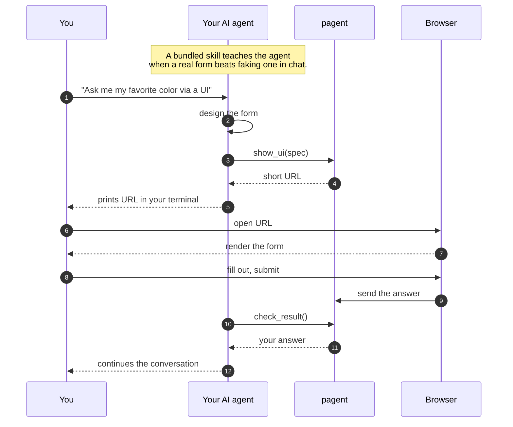

# Pagent

[](https://github.com/blockful/pagent/actions/workflows/ci.yml)

Hosted UI rendering for terminal-bound AI agents. The agent emits an A2UI surface to this service, prints a short URL, and reads the user's interactions back via API.

- **Live API:** https://pagent.up.railway.app
- **Live renderer:** https://pagent.vercel.app

See [PRD.md](./PRD.md) for the design and [HANDOFF.md](./docs/HANDOFF.md) for build context.

## How it works

A non-technical view of what happens when your agent decides it needs a form:



In plain English: the agent reads its skill, decides a real form is the right way to ask, hands a form description to the service, and prints a short URL in your terminal. You open it in the browser, fill it out, submit. The agent reads your answer back and the conversation keeps going. The agent never sees you typing — only the final result.

## Layout

npm-workspaces monorepo. Three apps + the plugin scaffolding.

```
apps/
├── api/                             # REST service (Hono). Deployed on Railway.
│   ├── server.ts
│   ├── railway.json
│   └── .env.example
├── web/                             # Vite-served renderer. Deployed on Vercel.
│   ├── index.html, main.ts
│   ├── vite.config.ts
│   ├── vercel.json
│   └── .env.example
└── mcp/                             # stdio MCP server: show_ui + check_result
    ├── server.ts                     # source
    ├── server.bundle.js              # esbuild output, shipped to plugin users
    ├── smoke.mjs
    └── .env.example
skills/pagent/SKILL.md                # drop-in skill teaching the polling pattern
.claude-plugin/plugin.json            # Claude Code plugin manifest
.mcp.json                             # plugin's MCP server registration
```

The repo doubles as a Claude Code plugin and a self-hosted marketplace: `.claude-plugin/plugin.json`, `.claude-plugin/marketplace.json`, `skills/`, and `.mcp.json` at the repo root make it installable from GitHub with two slash commands. The skill stays at the root because Claude Code's plugin loader looks for `skills/` next to `.claude-plugin/`, even though the skill conceptually belongs to `apps/mcp/`.

## Environment variables

Each app validates its environment at boot/build with Zod and fails loudly on missing or malformed values — no silent defaults that bite in production. `.env.example` files in each app are the source of truth.

| App                                               | Variable                   | Required?           | Validation / default                                                                                |
| ------------------------------------------------- | -------------------------- | ------------------- | --------------------------------------------------------------------------------------------------- |
| **api** ([`.env.example`](apps/api/.env.example)) | `DATABASE_URL`             | **always**          | Non-empty string. Boot fails with a `ZodError` otherwise.                                           |
|                                                   | `PUBLIC_URL`               | **production**      | Valid URL. Used in `show_ui` responses.                                                             |
|                                                   | `ALLOWED_ORIGINS`          | **production**      | Comma-separated origin list. CORS allow-list.                                                       |
|                                                   | `PORT`                     | optional            | Coerced to number. Default `8787`. Railway sets this.                                               |
|                                                   | `PAGE_TTL_MS`              | optional            | Coerced to number. Default `1800000` (30 min).                                                      |
|                                                   | `RATE_LIMIT_MAX`           | optional            | Positive integer. Default `30`.                                                                     |
|                                                   | `RATE_LIMIT_WINDOW_MS`     | optional            | Positive integer. Default `60000`.                                                                  |
|                                                   | `NODE_ENV`                 | optional            | One of `development` \| `production` \| `test`. Gates the production-only refinements above.        |
|                                                   | `LOG_LEVEL`                | optional            | Pino level. Default `info`.                                                                         |
|                                                   | `OTEL_EXPORTER_OTLP_*`     | optional            | OpenTelemetry exporter config. Leave `OTEL_EXPORTER_OTLP_ENDPOINT` unset to disable tracing.        |
| **web** ([`.env.example`](apps/web/.env.example)) | `VITE_API_URL`             | **`vite build`**    | Valid URL. Inlined at build time and embedded in CSP. `vite dev` allows it unset (uses Vite proxy). |
|                                                   | `API_PORT` / `CLIENT_PORT` | optional (dev only) | Valid port (1–65535). Defaults `8787` / `8788`.                                                     |
| **mcp** ([`.env.example`](apps/mcp/.env.example)) | `PAGENT_URL`               | optional            | Valid URL when set. Default `https://pagent.up.railway.app`.                                        |

When validation fails, the process logs the offending field and exits with a non-zero code — CI catches misconfigured deploys (`build:web` runs in CI with a placeholder `VITE_API_URL`) before they ship.

## Install as a Claude Code plugin

**Prerequisites:** Claude Code, Node 22+.

**1. Install** — paste these two commands into any Claude Code session:

```
/plugin marketplace add blockful/pagent
/plugin install pagent@pagent
```

The MCP server ships pre-bundled (`apps/mcp/server.bundle.js`), so there's no `npm install` step on your side — Claude Code can spawn it directly.

**2. Verify** — confirm the MCP server is connected:

```
/mcp
```

You should see `pagent` listed with `show_ui` and `check_result` tools. The plugin also ships a skill (`pagent`) that teaches the polling pattern.

**3. Use it** — try this prompt:

> "Use the pagent skill to ask me my favorite color via a UI form."

The agent calls `show_ui`, prints a URL (hosted at `https://pagent.vercel.app`), you submit, and the conversation continues.

**Point at a different service?** Set `PAGENT_URL` before launching Claude. By default the MCP talks to `https://pagent.up.railway.app`.

## Use it from any MCP client (HTTP transport)

Beyond the Claude Code plugin, pagent's MCP also speaks the streamable HTTP transport — so any MCP-capable client (Codex, OpenCode, Cursor, Cline, Continue, etc.) can connect with one command and zero local install:

```bash
# Claude Code, without the plugin (HTTP MCP, scoped to the current project)
claude mcp add --scope project --transport http pagent "https://pagent.up.railway.app/mcp"
```

For other clients, drop this into whichever `mcp.json` / config file they read:

```json
{
  "mcpServers": {
    "pagent": {
      "type": "http",
      "url": "https://pagent.up.railway.app/mcp"
    }
  }
}
```

The HTTP MCP runs in the same process as the REST service (single Railway deploy, no extra infra) and shares its tool definitions with the bundled stdio MCP — `show_ui` / `check_result` behave identically across transports, including the polling-pattern guidance baked into the tool descriptions.

**Self-hosting?** Replace the URL with `http://your-host:8787/mcp`.

## Quick start (development)

```bash
git clone git@github.com:blockful/pagent.git
cd pagent
npm install                         # workspaces install for all three apps
npm run dev                         # API on :8787, renderer on :8788
npm run build:mcp                   # rebuild apps/mcp/server.bundle.js after editing server.ts
```

Open `http://localhost:8788/<page_id>` to view a page. To use the local API from a Claude session, install the plugin from the local checkout instead of the marketplace:

```bash
claude --plugin-dir /absolute/path/to/pagent
PAGENT_URL=http://localhost:8787 claude   # then talk to local API
```

### Shutdown behavior

The API handles `SIGTERM` and `SIGINT` gracefully:

1. Stops accepting new connections.
2. Waits up to 10 seconds for in-flight requests to finish.
3. Force-closes idle keep-alives if the timeout is hit.
4. Closes the Postgres pool and exits.

Railway sends SIGTERM during deploys; Ctrl+C in dev sends SIGINT.

### Quality gate

A Husky `pre-push` hook runs `typecheck → lint → format:check → test`
on every `git push`. To run it manually before pushing:

    .husky/pre-push

To bypass in an emergency: `git push --no-verify` (don't make this a habit).

## Deploy

### `apps/api/` → Railway

`apps/api/railway.json` contains the build + start config. To deploy:

1. Create a new Railway service from this repo.
2. Set **Root Directory** to `apps/api` so Railway picks up the railway.json.
3. Set environment variables (see `apps/api/.env.example`):
   - `PUBLIC_URL` — the Vercel URL of `apps/web` (e.g. `https://pagent.vercel.app`). Used in `show_ui` responses. **Required in production.** Boot fails loudly if missing.
   - `ALLOWED_ORIGINS` — comma-separated origins allowed to call the API (set to your Vercel URL). **Required in production.** API boot fails loudly if missing.
   - `PORT` — Railway sets this automatically; the server reads it.
   - `PAGE_TTL_MS` — optional; default 30 minutes.
   - `RATE_LIMIT_MAX` / `RATE_LIMIT_WINDOW_MS` — optional. Per-IP rate limit on `POST /new`. Defaults: 30 / 60000 (30 req/min). Tune up for load tests.
   - `OTEL_EXPORTER_OTLP_ENDPOINT` — optional. Grafana Cloud OTLP HTTP base URL (e.g. `https://otlp-gateway-prod-us-central-0.grafana.net/otlp`). Leave unset to disable observability entirely. See `apps/api/.env.example` for the rest of the OTel envs.
4. Deploy. Railway runs `npm install` (which walks up to the workspace root) and starts the API with `npm -w @pagent/api run start`.

The `/health` endpoint is configured as the healthcheck path. Returns 200 only when the DB is reachable; 503 otherwise.

### `apps/web/` → Vercel

`apps/web/vercel.json` handles the build. To deploy:

1. Create a new Vercel project from this repo.
2. Set **Root Directory** to `apps/web` so vercel.json is picked up.
3. Set environment variables (see `apps/web/.env.example`):
   - `VITE_API_URL` — the Railway URL of `apps/api` (e.g. `https://pagent.up.railway.app`). Inlined at build time, so a redeploy is needed if this changes. **Required for `vite build`** — the build fails loudly if missing or malformed (prevents shipping a bundle that silently calls relative paths).
4. Deploy. Vercel runs `npm install` from the monorepo root (workspace install) and `npm run build:web`, outputting `apps/web/dist/`.

`vite dev` (i.e. `npm run dev`) does not require `VITE_API_URL` — it falls back to Vite's proxy for same-origin paths, so local development works zero-config.

#### Security headers

The renderer derives its strict Content-Security-Policy from
`VITE_API_URL` at build time and injects it as a `<meta>` tag in
`index.html`. Self-hosters at a different API origin only need to
set `VITE_API_URL` correctly when deploying to Vercel — no source
edit required. HSTS / nosniff / frame-deny / referrer-policy /
permissions-policy are set as HTTP headers via `apps/web/vercel.json`.

### Order matters

Deploy Railway first to get the API URL. Then deploy Vercel with `VITE_API_URL` set to it. Then go back to Railway and set `PUBLIC_URL` + `ALLOWED_ORIGINS` to the Vercel URL.

## Operations

This section is for on-call engineers. It documents the observable surface of the
system so you can answer "is it broken, what broke, how do I fix it?" without
reading the code.

- **Machine-readable API contract:** `GET /openapi.json` (canonical JSON, OpenAPI 3.1) or `GET /openapi.yaml` (same spec, raw YAML for humans). Interactive reference at `GET /docs` (Scalar). Source lives at `docs/openapi.yaml` in the repo and is loaded once at boot.

### Health check

```
GET /health
```

This is an ops endpoint, not part of the API contract. Railway polls it
automatically and restarts the service on 503.

**Healthy response** (`200`):

```json
{ "ok": true, "db": "ok" }
```

**Failure response** (`503`) — Postgres is unreachable:

```json
{ "ok": false, "db": "error" }
```

There is no `pages` count in the response; the field was removed in an earlier
refactor. The response shape is exactly what is shown above.

Quick smoke from the terminal:

```bash
curl -sf https://pagent.up.railway.app/health
```

### Logs and traces

**Logs:** The API uses [Pino](https://getpino.io). In production (`NODE_ENV=production`)
every event is one JSON object per line. In dev the output is pretty-printed via
`pino-pretty`. Each line carries at minimum `level`, `time`, and `msg`, plus
per-event fields. Request log lines look like:

```
{"level":30,"time":1709120000000,"req_id":"a1b2c3d4e5f6a7b8c9d0e1f2a3b4c5d6","method":"POST","path":"/new","status":201,"duration_ms":17,"msg":"request"}
```

Every response carries `X-Request-ID` (32-char hex). Quote it in bug
reports — the same ID appears on every log line for that request and
any traces in Grafana.

Where to find them: **Railway dashboard → API service → Logs tab**.

**Traces:** If `OTEL_EXPORTER_OTLP_ENDPOINT` is set, traces flow to Grafana Cloud
(Tempo) over OTLP/HTTP. Auto-instrumentation covers HTTP, fetch, and Postgres.
The Pino instrumentation injects `trace_id` and `span_id` into every log line,
so pivoting from a log line to its trace in Grafana is a single click. Leave
`OTEL_EXPORTER_OTLP_ENDPOINT` unset to disable OTel entirely — the SDK does not
start and there is zero overhead.

**No metrics endpoint:** there is no `/metrics` or Prometheus scrape target.
Operations rely on log aggregation and traces. Build throughput/latency dashboards
in Grafana from the trace and log streams.

### Common failure modes

| Symptom                                                   | Likely cause                                             | Where to look                                    | First response                                                                                                                           |
| --------------------------------------------------------- | -------------------------------------------------------- | ------------------------------------------------ | ---------------------------------------------------------------------------------------------------------------------------------------- |
| `GET /health` → 503                                       | Postgres unreachable                                     | Supabase status page; Railway DB env vars        | Check Supabase dashboard. If the DB is up but the env var was rotated, restore `DATABASE_URL` in Railway and redeploy.                   |
| Spike of 429s on `POST /new`                              | Per-IP rate limit hit (default 30 req / 60 s)            | Railway logs — group by client IP                | Legit spike: bump `RATE_LIMIT_MAX` in Railway env and restart (no redeploy needed). Abuse: block at the network edge.                    |
| 413 on `POST /new`                                        | Request body > 256 KB                                    | Log field `error: payload_too_large`             | If a real use case, raise `MAX_BODY_BYTES` in `apps/api/app.ts` (code change + redeploy). Otherwise it's spam; ignore.                   |
| CORS errors in the browser console at `pagent.vercel.app` | `ALLOWED_ORIGINS` does not include the renderer's origin | Browser DevTools → Network → failing preflight   | Add the missing origin to `ALLOWED_ORIGINS` in Railway env and restart the service.                                                      |
| Boot failure with `ZodError` in Railway logs              | A required env var is missing                            | Railway logs (the process exits before it binds) | Read the Zod validation error — it names the missing field. Usually `PUBLIC_URL` or `ALLOWED_ORIGINS`. Set it in Railway, then redeploy. |

### Rollback

The MCP plugin marketplace tracks `main`. Rolling back means reverting the bad
commit on `main`; Railway and Vercel auto-redeploy on push.

```bash
git checkout main && git pull
git revert <bad-sha>          # creates a revert commit, safe for shared history
git push
```

If the branch is not yet shared and a hard reset is acceptable:

```bash
git reset --hard <prev-good-sha>
git push --force-with-lease
```

Watch CI go green, then verify:

```bash
curl -sf https://pagent.up.railway.app/health && echo ok
```

### Operational tunables

These env vars can be changed in Railway (or locally in `apps/api/.env`) to tune
behaviour without touching code. `apps/api/.env.example` is the source of truth.

| Var                           | Default                   | Effect                                                                                                    |
| ----------------------------- | ------------------------- | --------------------------------------------------------------------------------------------------------- |
| `PORT`                        | `8787`                    | Port the server listens on. Railway overrides this automatically.                                         |
| `PUBLIC_URL`                  | _(required in prod)_      | Base URL of the renderer, returned in `show_ui` responses. Redeploy required after change.                |
| `PAGE_TTL_MS`                 | `1800000` (30 min)        | How long a page lives before expiring. Raising it keeps pages alive longer but grows the DB.              |
| `ALLOWED_ORIGINS`             | _(required in prod)_      | Comma-separated origins the CORS middleware allows. Add an origin here and restart — no redeploy.         |
| `RATE_LIMIT_MAX`              | `30`                      | Maximum requests per window per client IP on `POST /new`. Raise for load tests; restart picks it up.      |
| `RATE_LIMIT_WINDOW_MS`        | `60000` (60 s)            | The rolling window for the rate limit above.                                                              |
| `OTEL_EXPORTER_OTLP_ENDPOINT` | _(unset = OTel disabled)_ | Grafana Cloud OTLP HTTP base URL. Set to enable traces; unset to disable. Restart required.               |
| `LOG_LEVEL`                   | `info`                    | Pino log level: `fatal \| error \| warn \| info \| debug \| trace`. Lower = more noise. Restart required. |

### What we don't have yet

Gaps to keep expectations calibrated:

- **No metrics endpoint.** Build latency/throughput dashboards from the trace and log streams in Grafana.
- **No staging environment.** Every merge to `main` ships directly to the production Railway and Vercel services.
- **No automated rollback.** The procedure above is manual. Wire a Grafana alert to trigger a revert workflow if you want automation.
- **No alerting beyond Railway's healthcheck restart loop.** Add your own: Grafana alert on `/health` 503 rate, log error rate, or p95 latency when ready.
- **No CHANGELOG.** Release notes live in GitHub Releases.

## API

```
POST   /new                  body: { spec }     -> { id, url, expires_at }
GET    /:id                                     -> { spec, state, result, expires_at }
POST   /:id/result           body: <action>     -> { ok }              (browser submits)
GET    /:id/result                              -> { state, result }   (agent reads, marks "received" on first read)
```

The API publishes its OpenAPI 3.1 spec at the conventional locations:

- `GET /openapi.json` — canonical machine-readable spec (what every third-party tool expects)
- `GET /openapi.yaml` — same spec in YAML for humans
- `GET /docs` — interactive Scalar API Reference

The hand-authored source lives at `docs/openapi.yaml` and is loaded once at boot.

The `spec` body is opaque to the service. V0 assumes A2UI v0.9 — there is no `format` tag on the wire.

A page is single-shot and walks a 3-state machine: `open -> submitted -> received`. `POST /:id/result` requires `state === "open"` (otherwise 409). The first `GET /:id/result` after submit returns `state: "submitted"` and flips the page to `received`; subsequent reads return `state: "received"`. The renderer can detect that transition via `GET /:id` to upgrade its "waiting for the agent" banner.

## Smoke test

With `npm run dev` running, in another terminal:

```bash
npm run smoke
# (alias for `node apps/mcp/smoke.mjs`)
# follow the printed URL, fill the form — check_result returns the action
```

Or with curl, end-to-end:

```bash
# 1. Create a page with a spec.
curl -s -X POST http://localhost:8787/new \
  -H 'content-type: application/json' \
  -d '{"spec":[{"createSurface":{"surfaceId":"main","catalogId":"https://a2ui.org/specification/v0_9/basic_catalog.json"}},{"updateComponents":{"surfaceId":"main","components":[{"id":"root","component":"Column","children":["title","field","submit"]},{"id":"title","component":"Text","text":"Color?"},{"id":"field","component":"TextField","label":"Color","value":{"path":"/color"}},{"id":"submit-label","component":"Text","text":"Send"},{"id":"submit","component":"Button","child":"submit-label","variant":"primary","action":{"event":{"name":"submitted","context":{"color":{"path":"/color"}}}}}]}}]}'
# -> { "id": "<pageId>", "url": "http://localhost:8788/<pageId>", "expires_at": ... }

# 2. Open the URL in a browser and click Send. Then poll:
curl -s http://localhost:8787/<pageId>/result
# -> { "state": "open",      "result": null }       (before submit)
# -> { "state": "submitted", "result": { ... } }    (first read after submit; flips to received)
# -> { "state": "received",  "result": { ... } }    (subsequent reads)
```

## Releases

For the release procedure, see [docs/RELEASING.md](docs/RELEASING.md).

For security-related reports, see [SECURITY.md](SECURITY.md).

For contribution guidelines, see [CONTRIBUTING.md](CONTRIBUTING.md).
