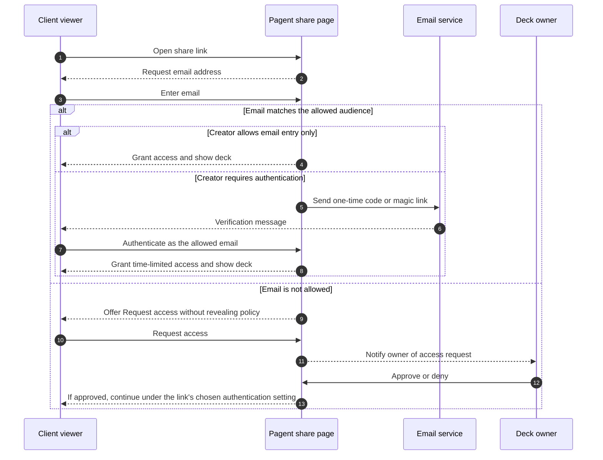

# PRD: Pagent v0.1.0 Secure Presentation Pages and Engagement Analytics

**Status:** Binding implementation contract
**Target release:** v0.1.0  
**Date:** 2026-09-15  
**Product:** Pagent  
**Working name:** Presentation pages

> **Binding clarification — 2026-09-16:** Page is Pagent's single product
> primitive. A presentation (historically called a Deck in this document and
> in internal storage) is a durable, revisioned page type. Agents receive
> exactly two MCP tools: `write` creates interactive, document, or presentation
> pages; `read` retrieves an interactive response or authorized presentation
> analytics. The former tool names are removed with no compatibility aliases.

## 1. Executive summary

Pagent v0.1.0 turns an agent-generated presentation into a durable, controlled
client-facing page. A sender can publish the presentation page, create one or
more share links, decide who may open each link, and understand how each
recipient engaged with the proposal.

The release adds four connected capabilities:

1. **Controlled page sharing:** public links, allowed-email access, or creator-required authentication.
2. **Viewer engagement analytics:** who viewed, active time, slides viewed, most-engaged slide, completion, and drop-off.
3. **Page management:** one dashboard to preview presentation pages, manage links and access, revoke sharing, and inspect engagement.
4. **Internal analytics permissions:** analytics can remain private or be shared with selected people, teams, or the verified workspace/domain.

Viewer access and internal analytics access are intentionally separate. Giving a client access to a deck never grants access to its analytics. Sharing analytics with a colleague never changes who can view the client deck.

## 2. Product decisions in this draft

These are recommended defaults, not hidden assumptions:

- This scope is large enough to be **v0.1.0**, not v0.0.2.
- **Page** is the only product primitive. Interactive and document pages are temporary; presentation pages are durable, revisioned, shareable, and analyzable.
- The legacy word **Deck** remains in internal REST routes, database names, and some historical requirement IDs. It is an implementation detail, not a second public object.
- A deck may have multiple named share links, for example `Acme proposal` and `Board review`, so access and analytics can be managed per audience.
- Each share link lets its creator choose the friction level: anyone with the link, a matching allowed email with no verification, or authenticated access.
- Allowed-email access intentionally trusts the address a viewer enters. It is a convenience gate, not proof of identity, so Pagent labels those viewers as **Unverified** in analytics.
- For stronger protection, the creator can require authentication through a one-time code, magic link, Google sign-in, or an existing Pagent session.
- Private analytics are visible to the deck owner and the creator of the relevant share link. Workspace administrators see metadata but do not silently bypass private viewer-level analytics.
- Deck content is retained until deleted. Viewer-level analytics are retained for 12 months by default, subject to workspace policy.
- The first release supports agent-generated presentation pages with explicit slide boundaries. It does not infer reliable slide analytics from arbitrary temporary document pages.

## 3. Problem

Pagent can currently render an agent-generated HTML artifact at a unique URL, but the page is ephemeral and effectively bearer-link public. A proposal sender cannot confidently answer:

- Who is allowed to open this proposal?
- Did the intended client actually view it?
- How long did they actively engage with it?
- Which slides held attention?
- Where did they stop?
- Who on my team can see this client activity?
- Where can I find and manage all proposals I have sent?

This makes Pagent useful for showing an artifact, but not yet suitable as the system of record for client proposals, fundraising decks, sales presentations, or confidential reports.

## 4. Current product baseline

Pagent v0.0.1 already provides useful foundations:

- Agent-created A2UI and sanitized HTML pages.
- Postgres persistence for pages.
- Page ownership via `owner_id`.
- Google and magic-link authentication foundations.
- Coarse operational counters for page creation and page views.
- A view-only HTML renderer suitable for visual artifacts.

The current model is not sufficient for this feature:

- Pages expire after a short TTL and have no durable deck identity.
- The renderer has no stable slide model.
- Anyone with a page URL can fetch its content.
- There are no viewer entitlements, share-link records, teams, or workspace permissions.
- Current page-view metrics are aggregate operational telemetry, not user-facing engagement analytics.
- There is no deck library or analytics dashboard.

## 5. Goals

### 5.1 User goals

- Let a sender publish and share a proposal in under two minutes.
- Let a sender protect a deck without creating unnecessary friction for a client.
- Let a sender know who engaged, for how long, and with which slides.
- Let a sender quickly identify the last slide reached and the main drop-off point.
- Let an owner control which colleagues can see deck content, links, and viewer analytics.
- Let a manager find proposals by sender, client/link, status, and recent engagement.

### 5.2 Business goals

- Make Pagent useful after deck creation, not only at generation time.
- Establish a durable, collaborative product surface that users return to.
- Create a trustworthy analytics foundation for future notifications, CRM integrations, and engagement scoring.

### 5.3 Technical goals

- Reuse the current auth, HTML sanitization, and Postgres foundations.
- Expose exactly `write` and `read` over both MCP transports, with no legacy tool aliases.
- Keep page-type behavior simple: temporary interactive/document pages and durable presentation pages.
- Store raw engagement events separately from operational telemetry.
- Define analytics precisely enough that dashboard numbers are reproducible.

## 6. Non-goals for v0.1.0

- Full presentation authoring or collaborative slide editing.
- PDF, PowerPoint, or Keynote import.
- Data rooms containing multiple documents.
- E-signatures, payments, comments, or proposal acceptance workflows.
- SAML SSO, SCIM, or enterprise identity-provider enforcement.
- Dynamic watermarks, screenshot prevention, or DRM claims.
- CRM, Slack, or email automation integrations.
- AI-generated engagement scores or claims about buyer intent.
- Public analytics pages for external clients.
- Analytics for arbitrary document pages without explicit slide boundaries.

## 7. Terminology

| Term                     | Definition                                                                          |
| ------------------------ | ----------------------------------------------------------------------------------- |
| **Page**                 | Pagent's public product primitive.                                                  |
| **Presentation page**    | Durable, revisioned Page owned by a Pagent user or workspace.                       |
| **Deck**                 | Legacy/internal name for a presentation page.                                       |
| **Slide**                | Ordered, stable unit within a deck, identified by an immutable slide ID.            |
| **Deck revision**        | Immutable snapshot of deck content.                                                 |
| **Share link**           | Revocable URL for a deck, with its own name, access policy, expiry, and analytics.  |
| **Sender**               | User who creates a share link. May differ from the deck owner.                      |
| **Viewer**               | External or internal person opening a share link.                                   |
| **Visit**                | One engagement session for one viewer or anonymous browser on one share link.       |
| **Viewer access policy** | Rule controlling who may open a share link.                                         |
| **Analytics visibility** | Rule controlling which authenticated workspace members may inspect engagement data. |

In product UI and agent-facing contracts, use **Page** for the artifact and
**slide** for an ordered unit within a presentation page. Do not present Deck as
a separate object model.

## 8. Primary users and jobs

### 8.1 Sender or deck owner

> When I send a proposal, I want only the intended recipients to open it and I want to know how they engaged, so I can follow up with the right context.

### 8.2 Sales or account manager

> When several team members send proposals, I want a clear view of who sent what and which clients engaged, so I can coach the team and prioritize follow-up.

### 8.3 Client viewer

> When I receive a proposal, I want fast, trustworthy access with minimal friction and a clear explanation of why my email or sign-in is required.

### 8.4 Workspace administrator

> When my organization uses Pagent for client material, I want enforceable membership and sharing controls without automatically exposing every private client interaction.

## 9. Core user journeys

### 9.1 Publish and share a controlled deck

1. An agent publishes an ordered set of slides as a durable deck.
2. The owner opens the deck in Pagent and selects **Share**.
3. The owner names the link, for example `Acme - September proposal`.
4. The owner chooses an access mode and optional expiry.
5. For an email-restricted link, the owner adds exact email addresses and/or domains, then chooses whether viewers must authenticate.
6. Pagent creates the link and shows a copy action plus a preview-as-viewer action.
7. The owner can later revoke or edit the link without deleting the deck.

### 9.2 Open an email-restricted deck



### 9.3 Review engagement

1. The sender opens **Pages** and sees last viewed, unique viewers, average active time, and completion.
2. The sender opens a deck and selects **Analytics**.
3. The overview shows visits over time, average completion, top slide by active time, and drop-off distribution.
4. The sender selects a viewer to see each visit, slide sequence, active time per slide, furthest slide reached, and last slide viewed.
5. Public-link visits appear as anonymous unless the viewer later authenticates in the same visit.

### 9.4 Share analytics internally

1. The owner opens **Analytics access** for a deck.
2. The owner selects one scope: Private, Selected people, Team, or Workspace/domain.
3. Pagent previews exactly who will gain access.
4. The owner confirms the change.
5. Newly authorized users can find the deck under **Shared with me** and view analytics, but cannot change external sharing unless separately granted that permission.

## 10. Product model

### 10.1 One Page primitive, lifecycle by type

Interactive and document pages use the short-lived Page lifecycle. A
presentation page is durable and publishing creates an immutable initial
revision. The different retention and permission rules do not create a second
agent-facing object model.

Agent-facing creation uses `write` with a required `type` discriminator:

- `interactive`: an A2UI specification for a temporary, single-response page.
- `document`: sanitized HTML for a temporary, view-only page.
- `presentation`: title, ordered slides with stable IDs and sanitized HTML,
  plus optional description, client/account label, or `page_id` update target.

Agent-facing retrieval uses `read`. It returns a temporary interactive response
or authorized presentation analytics based on `page_id`; callers may set
`include` explicitly. Durable writes and analytics reads require authentication.
Temporary writes and response reads may be anonymous only while rollout grace
mode is enabled. Requests that present invalid or expired Bearer credentials
fail closed with `401`; grace-mode callers choosing anonymous access omit the
`Authorization` header.

Explicit slide boundaries remain a product requirement. MCP advertises only
`write` and `read`; link management and governance stay in the authenticated
web/REST surfaces.

### 10.2 One presentation page, multiple share links

A sender may create multiple links for the same presentation page. Each link has its own:

- Name/client label.
- Creator/sender.
- Access mode and audience.
- Expiration and revocation state.
- Visit and viewer analytics.

Analytics can be viewed per link or aggregated across the presentation page. This lets a sender compare audiences without duplicating content.

### 10.3 Revisions

- Editing or republishing a presentation page creates a new immutable revision.
- Authorized editors can browse and preview earlier revisions from the Page's
  version history.
- Restoring an earlier revision creates a new latest revision from that
  snapshot; it never overwrites or deletes existing history.
- By default, active share links follow the latest published revision.
- Historical visits retain the revision ID viewed, so slide analytics remain interpretable.
- Reordering or deleting slides never rewrites historical event meaning.

Pinning a link to a specific revision is P1 if it threatens the release schedule.

## 11. Functional requirements

Priority meanings:

- **P0:** Required to ship v0.1.0.
- **P1:** Strongly desired, may follow immediately after launch.
- **P2:** Future consideration.

### 11.1 Page library and management

| ID    | Priority | Requirement                                                                                                                                                 |
| ----- | -------- | ----------------------------------------------------------------------------------------------------------------------------------------------------------- |
| DM-01 | P0       | Authenticated users can open a **Pages** dashboard containing presentation pages they own and pages shared with them internally.                            |
| DM-02 | P0       | The list shows page title, owner, latest sender, status, access mode, link count, unique viewers, last viewed, and last updated.                            |
| DM-03 | P0       | Users can search by page title, link/client name, owner, or sender.                                                                                         |
| DM-04 | P0       | Users can filter by Mine, Shared with me, Team/workspace, active, expired, and revoked.                                                                     |
| DM-05 | P0       | A presentation-page detail screen contains Preview, Analytics, Share links, and Settings/Access.                                                            |
| DM-06 | P0       | Owners can rename, archive, restore, and delete a page. Deletion requires confirmation and revokes all links immediately.                                   |
| DM-07 | P0       | Users can preview the exact latest presentation revision without generating analytics.                                                                      |
| DM-08 | P1       | Users can duplicate a presentation page or create a new client-specific link from the list.                                                                 |
| DM-09 | P0       | Workspace administrators can open `/admin` for membership, policy, audit, and page-metadata governance without implicit content or viewer-analytics access. |
| DM-10 | P1       | Authorized editors can list and preview earlier revisions and restore one as a new latest revision without mutating existing history.                       |

### 11.2 External viewer access

| ID    | Priority | Requirement                                                                                                                                                     |
| ----- | -------- | --------------------------------------------------------------------------------------------------------------------------------------------------------------- |
| VA-01 | P0       | Every share link uses exactly one access mode from the table below.                                                                                             |
| VA-02 | P0       | Owners and authorized senders can edit access settings, expire a link at a chosen time, or revoke it immediately.                                               |
| VA-03 | P0       | Allowed-audience matching is case-insensitive and supports exact email addresses and domains.                                                                   |
| VA-04 | P0       | In Allowed email mode, a viewer enters a matching address and receives deck access without proving control of that inbox.                                       |
| VA-05 | P0       | In Authenticated mode, the viewer must prove control of an allowed email or sign into an allowed Pagent account before deck content is served.                  |
| VA-06 | P0       | A non-allowed viewer may request access. Responses must not reveal whether an address or domain is on the allowed list.                                         |
| VA-07 | P0       | Owners and link creators can approve or deny pending requests. Approval applies only to the relevant link and still follows that link's authentication setting. |
| VA-08 | P0       | Revoked, deleted, or expired links never return deck content, including through direct API requests.                                                            |
| VA-09 | P0       | A viewer access session expires after 7 days or when the link expires/revokes, whichever occurs first. Its identity-confidence level is retained.               |
| VA-10 | P0       | The owner can preview the link as a viewer without creating a real visit.                                                                                       |
| VA-11 | P1       | Owners can bulk import allowed emails from CSV.                                                                                                                 |
| VA-12 | P1       | Owners can resend, cancel, and audit invitations.                                                                                                               |

#### Access modes

| Mode                     | Viewer experience                                                                                                                 | Identity confidence                             | Intended use                                           |
| ------------------------ | --------------------------------------------------------------------------------------------------------------------------------- | ----------------------------------------------- | ------------------------------------------------------ |
| **Anyone with link**     | Opens immediately.                                                                                                                | Anonymous browser session.                      | Public or low-sensitivity material.                    |
| **Allowed email**        | Enters an address that matches an allowed email/domain. No code, magic link, or sign-in is required.                              | Self-declared email, explicitly **Unverified**. | Low-friction proposals where convenience is preferred. |
| **Authenticated viewer** | Enters an allowed email and verifies it, or signs into an allowed Pagent account with Google, magic link, or an existing session. | Verified email or authenticated Pagent user.    | Confidential decks or recurring collaborators.         |

In the share UI, the creator first chooses **Anyone** or **Specific emails/domains**. For a specific audience, **Require authentication** is a creator-controlled setting. When it is off, the effective mode is Allowed email; when it is on, the effective mode is Authenticated viewer.

Allowed email is still an access rule, but it only proves that the viewer knows an approved address. The share settings must explain this tradeoff and recommend authentication for confidential material.

### 11.3 Viewer experience

| ID    | Priority | Requirement                                                                                                     |
| ----- | -------- | --------------------------------------------------------------------------------------------------------------- |
| VX-01 | P0       | The share page clearly identifies the deck or sender before asking for an email or sign-in.                     |
| VX-02 | P0       | Access screens explain why information is requested and link to the privacy notice.                             |
| VX-03 | P0       | The deck supports next/previous controls, keyboard navigation, slide count, mobile layout, and fullscreen.      |
| VX-04 | P0       | Refreshing or reopening a valid viewer session does not repeat email entry or authentication unnecessarily.     |
| VX-05 | P0       | Denied, pending, expired, and revoked states have distinct human-readable screens without leaking deck content. |
| VX-06 | P0       | Viewer tracking never blocks slide navigation. Events queue locally and send asynchronously.                    |
| VX-07 | P0       | The viewer meets WCAG 2.2 AA for the access gate and presentation controls.                                     |
| VX-08 | P1       | The sender may add a short welcome message and contact information to a share link.                             |

### 11.4 Engagement capture

| ID    | Priority | Requirement                                                                                                                                                                                                                                            |
| ----- | -------- | ------------------------------------------------------------------------------------------------------------------------------------------------------------------------------------------------------------------------------------------------------ |
| EA-01 | P0       | Pagent creates a visit only after client-side code confirms a visible, interactive browser session. Link preview bots must not count as human visits.                                                                                                  |
| EA-02 | P0       | Each visit records share link, deck revision, viewer identity when known, identity confidence (Anonymous, Unverified email, or Authenticated), start/end, device class, browser family, and coarse country when legally and operationally appropriate. |
| EA-03 | P0       | Each slide records first seen, active duration, view count within the visit, and order of appearance.                                                                                                                                                  |
| EA-04 | P0       | Slide time accumulates only while at least 50% of the slide is visible, the tab is visible, and recent user activity indicates the viewer is present.                                                                                                  |
| EA-05 | P0       | Tracking pauses when the tab is hidden and after 60 seconds without focus, navigation, pointer, touch, or keyboard activity. It resumes on activity.                                                                                                   |
| EA-06 | P0       | The client sends a heartbeat at most every 10 seconds and flushes a final best-effort event on page hide. The server derives trusted durations and rejects impossible values.                                                                          |
| EA-07 | P0       | Duplicate or retried events are idempotent. Events arriving out of order do not inflate duration.                                                                                                                                                      |
| EA-08 | P0       | Internal preview sessions and authenticated owner/editor visits are excluded from client analytics by default.                                                                                                                                         |
| EA-09 | P0       | A visit closes after 30 minutes of inactivity. A later return creates a new visit.                                                                                                                                                                     |
| EA-10 | P1       | Track outbound link clicks and presentation CTA clicks with slide attribution.                                                                                                                                                                         |
| EA-11 | P1       | Let an owner remove a known bot/test visit from user-facing analytics while preserving an audit record.                                                                                                                                                |

### 11.5 Analytics dashboard

| ID    | Priority | Requirement                                                                                                                                                                    |
| ----- | -------- | ------------------------------------------------------------------------------------------------------------------------------------------------------------------------------ |
| AD-01 | P0       | Deck overview shows total visits, unique viewers, last viewed, average active time, and average completion for a selected date range.                                          |
| AD-02 | P0       | The dashboard shows the deck owner and the sender/link creator for attribution.                                                                                                |
| AD-03 | P0       | The Slides view shows, per slide, unique viewers, view rate, average active time, total active time, and exits.                                                                |
| AD-04 | P0       | The Visitors view lists viewer email or Anonymous, an Unverified/Authenticated identity label, first/last visit, visits, total active time, and maximum completion.            |
| AD-05 | P0       | A visit detail shows slide sequence, active time by slide, furthest slide reached, last slide viewed, and completion.                                                          |
| AD-06 | P0       | Users can filter analytics by share link, viewer, sender, revision, and date range.                                                                                            |
| AD-07 | P0       | Allowed-email visits show the entered address as Unverified. Public visits remain Anonymous. Neither is relabeled Authenticated without an authentication event in that visit. |
| AD-08 | P0       | Empty and low-data states explain what will appear after a real visit.                                                                                                         |
| AD-09 | P1       | Export permitted analytics to CSV. Export obeys the same permissions as the dashboard and is audit logged.                                                                     |
| AD-10 | P1       | Send an optional notification to the link creator after the first human visit, including the visitor's identity-confidence label.                                              |

#### Metric definitions

| Metric                     | Definition                                                                                                                                                                              |
| -------------------------- | --------------------------------------------------------------------------------------------------------------------------------------------------------------------------------------- |
| **Visit**                  | A visible human browser session on one share link, closed after 30 minutes of inactivity.                                                                                               |
| **Unique viewer**          | Distinct authenticated viewer ID, normalized self-declared email within a link, or privacy-preserving link-scoped anonymous browser identifier. Confidence groups are shown separately. |
| **Active time**            | Deduplicated server-derived time while the deck or slide satisfies the visibility and activity rules.                                                                                   |
| **Slide viewed**           | At least 50% visible continuously for at least 1 second.                                                                                                                                |
| **Completion**             | Distinct slides viewed divided by total slides in the viewed revision.                                                                                                                  |
| **Furthest slide reached** | Highest slide ordinal that qualified as viewed, even if intermediate slides were skipped.                                                                                               |
| **Last slide viewed**      | Final qualifying slide before the visit ended.                                                                                                                                          |
| **Top slide**              | Slide with the highest total active time for the selected scope and date range.                                                                                                         |
| **Drop-off slide**         | Last slide viewed in a visit that did not reach 100% completion. The deck view shows the distribution of these exits.                                                                   |

Furthest slide reached and completion must both be shown. A viewer who jumps directly to slide 10 did not necessarily view 100% of a 10-slide deck.

### 11.6 Internal content and analytics permissions

| ID    | Priority | Requirement                                                                                                                                       |
| ----- | -------- | ------------------------------------------------------------------------------------------------------------------------------------------------- |
| AP-01 | P0       | Deck content collaboration and analytics visibility are explicit permissions. Neither permission implies permission to edit external share links. |
| AP-02 | P0       | The owner chooses one analytics visibility scope: Private, Selected people, Team, or Workspace/domain.                                            |
| AP-03 | P0       | Private is the default for newly published decks.                                                                                                 |
| AP-04 | P0       | Selected people and Team scopes only accept active authenticated workspace members.                                                               |
| AP-05 | P0       | Workspace/domain access requires authentication and verified workspace membership. Matching an email suffix alone is never sufficient.            |
| AP-06 | P0       | The settings screen previews named recipients or the effective audience before saving.                                                            |
| AP-07 | P0       | Removing access takes effect immediately for future API and UI requests.                                                                          |
| AP-08 | P0       | Link creators can see analytics for links they created unless the owner removes their deck membership or the user leaves the workspace.           |
| AP-09 | P0       | Workspace admins can see deck metadata for governance, but private deck content and viewer-level analytics require an explicit grant.             |
| AP-10 | P0       | Permission changes, exports, link changes, and viewer-access approvals are audit logged.                                                          |
| AP-11 | P1       | Owners can separately grant View deck, View analytics, and Manage sharing permissions to selected collaborators.                                  |

#### Analytics visibility scopes

| Scope                | Effective audience                                                       |
| -------------------- | ------------------------------------------------------------------------ |
| **Private**          | Deck owner plus the creator of each link for that link's analytics.      |
| **Selected people**  | Private audience plus explicitly selected workspace members.             |
| **Team**             | Private audience plus authenticated members of selected workspace teams. |
| **Workspace/domain** | All active authenticated members of the verified workspace.              |

## 12. Information architecture

### 12.1 Pages list

```text
Pages
  Filters: Mine | Shared with me | Team | Archived
  Search: page, client/link, owner, sender

  Page                 Owner       Sender       Access       Viewers  Last viewed
  Acme proposal        Ana         Marco        Allowlist    4        2h ago
  Series A deck        Ana         Ana          Public       18       1d ago
```

Primary row actions: Preview, Analytics, Share, More.

### 12.2 Presentation-page detail

```text
Acme proposal                                      [Preview] [Share]
Owner: Ana   Latest revision: 4   Status: Active

Overview | Visitors | Slides | Share links | Access & settings
```

- **Overview:** headline metrics, visits chart, top slides, recent visits.
- **Visitors:** known and anonymous viewer rollup, with visit drill-down.
- **Slides:** slide thumbnails and engagement metrics.
- **Share links:** client/link name, sender, access mode, expiry, status, views, actions.
- **Access & settings:** internal collaborators, analytics visibility, retention, archive/delete.

### 12.3 Workspace admin

`/admin` is an authenticated workspace surface for membership, roles,
retention/consent policy, audit activity, and presentation-page metadata.
Administrators do not gain private page content or viewer-level analytics by
visiting this surface; those still require an explicit grant.

## 13. Conceptual data model

This is a product-level model, not a final migration design. The `decks`,
`deck_revisions`, and related names below are internal persistence terms for
durable presentation pages; they do not add another MCP tool or public product
primitive.

| Entity                   | Key fields and purpose                                                                              |
| ------------------------ | --------------------------------------------------------------------------------------------------- |
| `workspaces`             | Name, verified domains, policy settings.                                                            |
| `workspace_members`      | User, workspace, role, status.                                                                      |
| `teams` / `team_members` | Internal audience groups.                                                                           |
| `decks`                  | Workspace, owner, title, status, latest revision, timestamps.                                       |
| `deck_revisions`         | Immutable revision number, content manifest, created by/at.                                         |
| `deck_slides`            | Revision, stable slide ID, ordinal, title, sanitized content.                                       |
| `share_links`            | Deck, sender, name/client, token hash, access mode, expiry, revoked state.                          |
| `share_link_audience`    | Allowed email, domain, Pagent user, or workspace membership rule.                                   |
| `access_requests`        | Link, requested email/user, state, approver, timestamps.                                            |
| `viewer_sessions`        | Link, entered or authenticated viewer identity, identity confidence, token hash, expiry/revocation. |
| `deck_collaborators`     | User/team/workspace subject and explicit internal permissions.                                      |
| `visits`                 | Link, revision, viewer or anonymous ID, timestamps, client metadata.                                |
| `slide_engagement`       | Visit, slide, first seen, active milliseconds, view count, last sequence.                           |
| `engagement_events`      | Append-only raw event stream used to derive visit and slide aggregates.                             |
| `audit_log`              | Permission, access, export, and link-management actions.                                            |

Sensitive bearer values are stored as hashes. Deck and analytics queries enforce authorization server-side, not only by hiding UI controls.

## 14. Security, privacy, and trust requirements

### 14.1 Access security

- Use high-entropy, non-sequential share tokens. Store only a token hash.
- Never place viewer emails, raw access tokens, or allowlist decisions in URLs.
- When the creator requires authentication, verification codes and magic links are single use, short lived, and rate limited.
- Allowed-email mode deliberately does not verify inbox ownership. The creator sees a clear warning and viewers are marked Unverified in analytics.
- Return generic responses for unknown, denied, and non-allowed emails to reduce address and policy enumeration.
- Revoke cached viewer sessions when a link or individual access rule is revoked.
- Apply authorization checks to deck content, thumbnails, analytics, and exports.
- Preserve the existing HTML no-script and sanitization constraints.

### 14.2 Privacy

- Tell viewers that engagement is measured before access is granted.
- Support a workspace setting that requires explicit analytics consent. If consent is declined, access policy still applies but only a minimal access audit event is stored.
- Collect the minimum device and location data needed for the product. Do not expose full IP addresses in the dashboard.
- Keep viewer identity link-scoped unless the viewer signs into Pagent or the workspace has another lawful identity basis.
- Provide owner/admin flows to delete a viewer's personal analytics and to honor workspace retention policy.
- Treat email, visit timelines, and slide-level behavior as personal data.
- Complete legal review for consent language, retention defaults, and regional requirements before general availability.

### 14.3 Analytics integrity

- Exclude owner previews and known internal/test traffic by default.
- Do not count server fetches, email security scanners, or social previews as human views.
- Label Anonymous, Unverified email, and Authenticated identities clearly and do not imply more certainty than the selected access mode provides.
- Present engagement as observed behavior, not purchase intent.

## 15. Competitive benchmark

Research was performed against first-party product and help documentation available on 2026-09-15.

| Product             | Relevant pattern                                                                                                                                                            | Implication for Pagent                                                                                                                           |
| ------------------- | --------------------------------------------------------------------------------------------------------------------------------------------------------------------------- | ------------------------------------------------------------------------------------------------------------------------------------------------ |
| **Dropbox DocSend** | Allow/block viewer lists, separate email-requirement and email-verification choices, and document performance with top pages and time per page.                             | Pagent should likewise let the creator choose lower-friction email entry or stronger authentication, while labeling identity confidence clearly. |
| **Pitch**           | Multiple analytics links per presentation, required email or passcode, visit length, slides viewed, per-link controls, and a workspace links overview showing link creator. | Model sharing as named links, retain sender attribution, and provide both deck-level and link-level analytics.                                   |
| **Papermark**       | Link security, expiry, allow/block rules, page-level durations, visitor histories, completion, and dashboard tabs for links, documents, visitors, and visits.               | A clear management hub plus visitor and visit drill-down is more useful than one aggregate chart.                                                |
| **Qwilr**           | Proposal dashboard, viewer/session analytics, time by content block, interaction timelines, roles, teams, and page ownership.                                               | Pagent should connect deck management, ownership, and content-level engagement rather than shipping analytics as a detached report.              |

### 15.1 Product opportunities for Pagent

- **Agent-native publishing:** the agent can publish a structured deck and create a controlled link in the same workflow.
- **Creator-controlled friction:** the creator can choose a simple allowed-email gate or require authentication, with explicit identity-confidence labels in analytics.
- **Permission clarity:** external viewer access and internal analytics access are separate, visible policies.
- **Portable automation later:** Pagent's MCP/API foundation can eventually let agents summarize engagement and prepare follow-ups with explicit user authorization.

### 15.2 Benchmark sources

- [Dropbox DocSend: allow or block viewers](https://help.dropbox.com/share/dropbox-docsend-restrict-access-allow-or-block-viewers)
- [Dropbox DocSend: document performance](https://help.dropbox.com/share/dropbox-docsend-documents-performance-tab)
- [Pitch: share an external link](https://help.pitch.com/en/articles/3748926-share-an-external-link-to-your-presentation)
- [Pitch: presentation analytics](https://help.pitch.com/en/articles/5592127-view-presentation-analytics)
- [Pitch: team links overview](https://help.pitch.com/en/articles/5132455-see-all-your-team-s-links-in-one-place)
- [Pitch: private and team folders](https://help.pitch.com/en/articles/3678628-organize-presentations-with-folders)
- [Papermark: track document views](https://www.papermark.com/docs/guides/track-document-views)
- [Papermark: dashboard overview](https://www.papermark.com/help/article/dashboard-overview)
- [Papermark: share a data room](https://www.papermark.com/help/article/share-data-room)
- [Qwilr: analytics](https://help.qwilr.com/article/156-analytics-insights)
- [Qwilr: dashboard](https://help.qwilr.com/article/712-meet-your-qwilr-dashboard)

## 16. Success metrics

### 16.1 Adoption

- At least 30% of published decks create a share link within 24 hours.
- Median time from deck publish to copied share link is under 2 minutes.
- At least 50% of active senders return to a deck analytics screen within 7 days of sharing.

### 16.2 Viewer experience

- At least 95% of valid public-link opens render the first slide within 2 seconds at p75 on a broadband connection.
- At least 95% of viewers entering a matching email on an Allowed email link reach the deck within 15 seconds.
- At least 90% of pre-approved viewers on an Authenticated viewer link complete authentication and reach the deck within 90 seconds.
- Fewer than 2% of eligible access attempts produce unrecoverable errors.

### 16.3 Analytics quality

- At least 99% of accepted heartbeats are processed idempotently.
- Dashboard totals reconcile with raw eligible visits within 1%.
- Owner previews and recognized link scanners contribute zero human visits.
- At least 95% of normally closed or backgrounded visits flush slide engagement within 60 seconds.

### 16.4 Trust and control

- Revocation blocks new deck-content requests within 10 seconds.
- Every analytics export and permission change produces an audit event.
- Zero known cases where a user can access analytics outside the effective visibility policy.

## 17. Release scope and sequencing

### Phase A: Durable presentation-page foundation

- Durable presentation-page, revision, and slide model.
- `write` publishing contract with explicit slide boundaries and `read` analytics contract.
- Page library, preview, ownership, and archive/delete.
- Workspace and minimal team membership required for internal permissions.

### Phase B: Controlled sharing

- Named share links.
- Public, Allowed email, and Authenticated viewer modes.
- Email entry, creator-controlled authentication, viewer sessions, expiry, revocation, and access requests.
- Viewer access screens and audit events.

### Phase C: Analytics

- Human-visit detection, activity heartbeats, slide engagement, and aggregation.
- Presentation-page overview, Visitors, Slides, and visit detail.
- Filters and sender attribution.

### Phase D: Internal collaboration

- Private, selected people, team, and workspace/domain analytics visibility.
- Shared with me.
- Permission management and governance metadata.

### Post-v0.1.0 roadmap: Version history and recovery

- Add a Versions surface to presentation Page detail with revision author,
  timestamp, and optional change summary.
- Preview any retained revision without generating viewer analytics.
- Restore an earlier revision by creating a new latest revision, preserving the
  complete history and revision-bound analytics.
- Keep versioning within `write` plus the authenticated web/REST management
  surfaces; do not add another MCP tool.

Phases A through D are part of v0.1.0. The version-history and recovery phase is
the next presentation-lifecycle milestone. The release may ship behind feature
flags, but v0.1.0 should not be described as complete until the secure
share-to-insight workflow works end to end.

## 18. Launch acceptance criteria

The release is ready when all of the following are observable in production or a production-equivalent environment:

1. Both MCP transports advertise exactly `write` and `read`; none of the former tool names are registered as aliases.
2. During grace mode, an anonymous caller can write and read a temporary interactive page; durable presentation writes and analytics reads still reject unauthenticated callers.
3. An authenticated owner can use `write` to publish a 10-slide presentation page, find it in Pages, and preview it without generating a client visit.
4. The owner can create separate Anyone, Allowed email, and Authenticated viewer links for the same presentation page.
5. A viewer entering a matching address on an Allowed email link reaches the page without a verification code, magic link, or sign-in and is labeled Unverified in analytics.
6. A viewer entering a non-allowed address cannot receive presentation content.
7. A viewer on an Authenticated viewer link cannot receive presentation content before authenticating as an allowed email/user.
8. A non-allowed viewer can request access, and an approved request continues under the link creator's selected authentication setting.
9. Revoking a link prevents an already-open browser from fetching additional protected presentation content after its next authorization check.
10. A client can navigate the full presentation on desktop and mobile using mouse/touch and keyboard controls.
11. After a real visit, the sender can use the page analytics UI or authorized `read` to see identity confidence, active time, viewed slides, top slide, furthest slide, last slide, and completion.
12. Skipping from slide 1 to slide 10 reports furthest slide 10 without reporting 100% completion.
13. Leaving a presentation page open in a background tab does not continue increasing active time.
14. Link preview bots and owner preview sessions do not appear as client visits.
15. A private presentation page's viewer analytics are denied to an ungranted workspace member at both UI and API layers.
16. Changing analytics visibility to Selected people, Team, or Workspace/domain grants only the previewed authenticated audience.
17. The Pages list identifies owner and sender and can be filtered by them.
18. Permission changes, access decisions, link revocation, and analytics exports are present in the audit log.
19. `/admin` exposes workspace membership, policy, audit, and page metadata without silently exposing private content or viewer-level analytics.
20. Deleting a presentation page revokes every share link and removes future access to content and analytics according to the retention/deletion policy.

## 19. Risks and mitigations

| Risk                                              | Impact                                                    | Mitigation                                                                                                      |
| ------------------------------------------------- | --------------------------------------------------------- | --------------------------------------------------------------------------------------------------------------- |
| Arbitrary HTML has no stable slide boundaries.    | Per-slide analytics are inaccurate or impossible.         | Require structured presentation slides and keep temporary document HTML outside slide analytics.                |
| Email entry is mistaken for authentication.       | A viewer who knows an allowed address may impersonate it. | Label Allowed email as Unverified, warn the creator, and recommend Authenticated viewer for confidential decks. |
| Background tabs inflate engagement.               | Senders make decisions from misleading data.              | Visibility, activity, heartbeat, and idle rules; server-side duration validation.                               |
| Link scanners create false views.                 | Noisy notifications and inflated metrics.                 | Create visits only after visible client execution and human-like interaction/heartbeat.                         |
| Workspace admins conflict with private analytics. | Loss of sender/client trust.                              | Metadata-only admin visibility by default; require explicit analytics grant.                                    |
| Presentation updates corrupt historical metrics.  | Old visits become uninterpretable.                        | Immutable revisions and stable slide IDs in every event.                                                        |
| Client analytics contain personal data.           | Regulatory and trust exposure.                            | Clear notice/consent control, minimal collection, retention, deletion, audit, and legal review.                 |
| The release attempts to build a full data room.   | Delayed delivery and unclear product.                     | Limit v0.1.0 to one deck per share link and defer multi-document rooms.                                         |

## 20. Open product decisions

These questions do not block the draft, but should be resolved before engineering estimation:

1. **Workspace admin override:** should enterprise workspace owners ever be able to force access to private deck content and analytics? Recommendation: no silent override in v0.1.0.
2. **Access request notifications:** email only for v0.1.0, or in-app inbox plus email? Recommendation: in-app state with email notification.
3. **Consent default:** always show analytics consent, or make it a workspace policy? Recommendation: workspace policy with regionally appropriate defaults, finalized after legal review.
4. **Retention:** is 12 months appropriate for viewer-level data? Recommendation: 12 months, configurable downward, with deletion on request.
5. **Link revision behavior:** version history and non-destructive restore are required. Should links always follow the latest revision or optionally stay pinned to the version originally sent? Recommendation: follow latest by default and add explicit pinning after the core history flow.
6. **Authenticated audience:** should v0.1.0 support only Pagent Google/magic-link accounts, or include enterprise SSO? Recommendation: reuse Pagent auth now and defer SSO.

## 21. Future extensions

- PDF/PPTX import and export.
- Notifications for first view, repeat visit, high completion, or CTA click.
- CRM and Slack integrations.
- Link-level custom branding and custom domains.
- Watermarks and NDA gates.
- Multi-document client rooms.
- Engagement summaries generated by an agent with explicit analytics permission.
- Optional fields on `write`/`read` for additional authorized automation; the public MCP surface remains exactly two tools.
